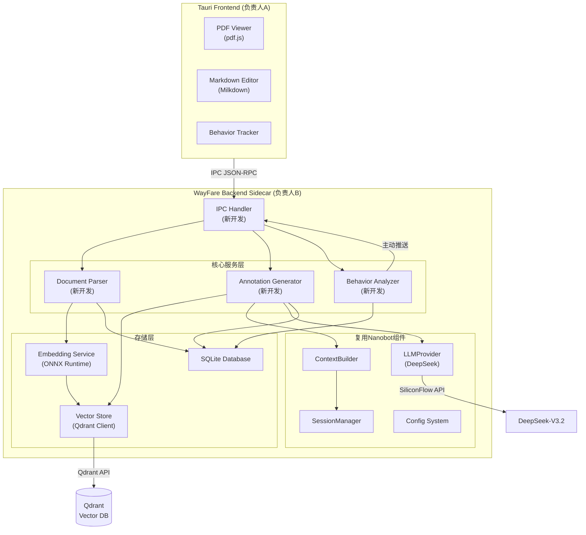
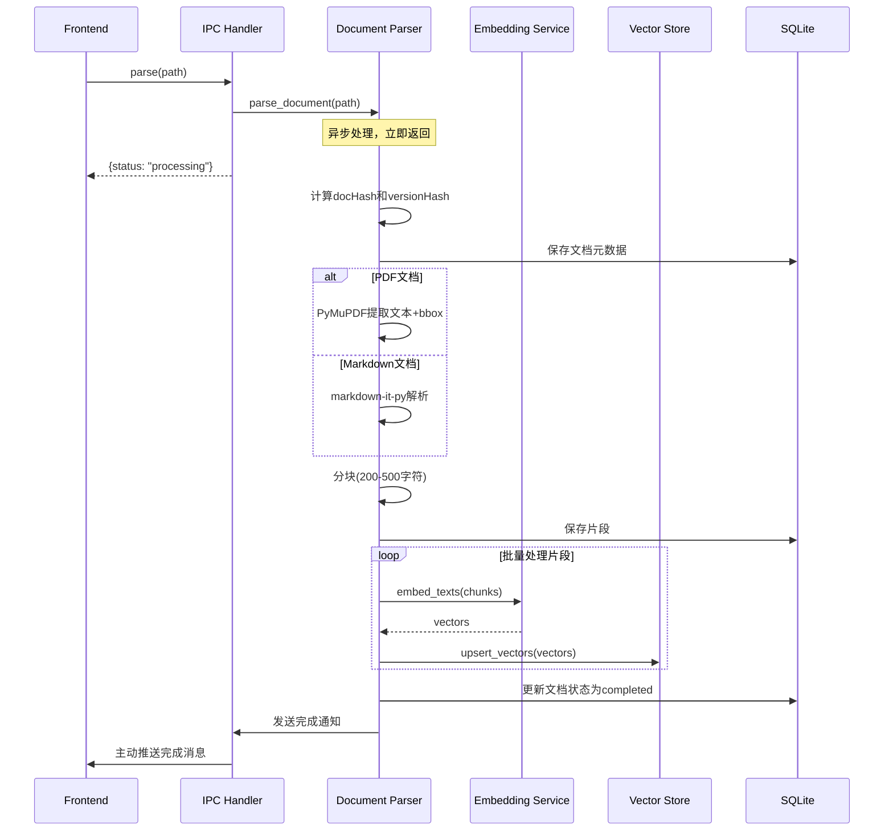
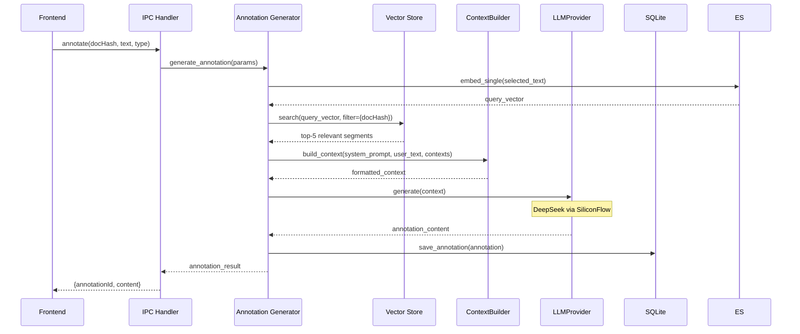
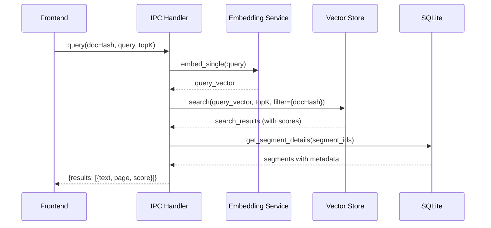
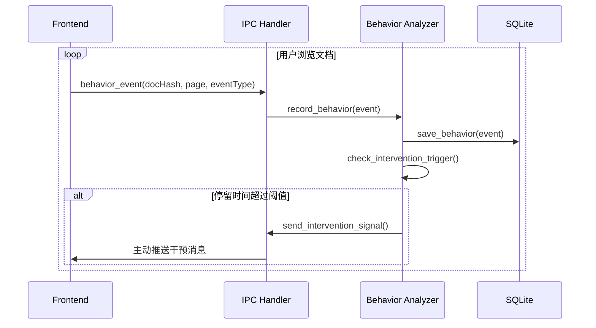

# WayFare MVP Backend 技术设计文档

## Overview

WayFare MVP Backend是一个智能学习助手的后端服务，作为Tauri应用的Sidecar进程运行。本系统的核心设计原则是**最大化复用nanobot框架的现有能力**，通过导入、继承和配置的方式避免重复开发基础设施。

### 系统定位

WayFare Backend负责"感知-决策-执行"架构中的决策层和部分感知层：
- **感知层**: 接收前端发送的文档解析请求和用户行为数据
- **决策层**: 基于RAG检索和LLM推理生成学习辅助批注
- **执行层**: 通过IPC协议向前端返回处理结果和主动推送

### 核心能力

1. **文档处理**: 解析PDF/Markdown文档，提取结构化片段
2. **向量检索**: 使用本地ONNX模型生成embedding，通过Qdrant进行语义检索
3. **批注生成**: 基于RAG上下文和LLM生成费曼式学习批注
4. **行为分析**: 分析用户学习行为，触发主动干预（MVP简化版）
5. **IPC通信**: 处理Tauri前端的JSON-RPC请求

### Nanobot复用策略

**直接导入使用的组件**:
- `LLMProvider`: 抽象LLM调用接口（DeepSeek via SiliconFlow）
- `ContextBuilder`: 构建LLM上下文和Prompt
- `SessionManager`: 管理用户会话状态
- `Config System`: Pydantic配置schema

**新开发但参考Nanobot模式的组件**:
- `Document_Parser`: 参考BaseTool设计模式
- `Embedding_Service`: 独立的ONNX推理服务
- `Vector_Store`: Qdrant客户端封装
- `Annotation_Generator`: 复用ContextBuilder和LLMProvider
- `IPC_Handler`: 处理Tauri IPC协议
- `Behavior_Analyzer`: MVP简化版行为分析

**不需要的Nanobot组件**:
- `AgentLoop`: WayFare使用IPC驱动而非消息总线
- `ChannelManager`: 不需要多渠道支持
- `CronService`: MVP不需要定时任务
- `SubagentManager`: MVP不需要子agent


## Architecture

### 整体架构图



### 模块职责划分

#### 1. IPC_Handler (新开发)
**职责**: 处理与Tauri前端的通信
- 接收和验证JSON-RPC格式的IPC请求
- 按seq序列号排序处理请求，防止"先发后到"
- 路由请求到对应的处理器（parse/annotate/query/config）
- 封装响应消息并返回给前端
- 处理异步操作（parse请求不阻塞）

**关键接口**:
```python
class IPCHandler:
    async def handle_request(self, message: dict) -> dict
    async def handle_parse(self, params: dict) -> dict
    async def handle_annotate(self, params: dict) -> dict
    async def handle_query(self, params: dict) -> dict
    async def handle_config(self, params: dict) -> dict
```

#### 2. Document_Parser (新开发)
**职责**: 解析文档并生成结构化片段
- 解析PDF文件（使用PyMuPDF）提取文本、页码、边界框
- 解析Markdown文件（使用markdown-it-py）提取结构化内容
- 将文档分割为语义连贯的片段（200-500字符）
- 生成文档hash（BLAKE3）和versionHash
- 存储片段到SQLite和向量数据库

**关键接口**:
```python
class DocumentParser:
    async def parse_pdf(self, path: str) -> ParseResult
    async def parse_markdown(self, path: str) -> ParseResult
    def chunk_text(self, text: str, metadata: dict) -> List[Segment]
    def compute_hash(self, path: str) -> str
```

#### 3. Embedding_Service (新开发)
**职责**: 生成文本向量
- 加载BAAI/bge-small-zh-v1.5 ONNX模型
- 批量处理文本生成512维向量
- 优化推理性能（批处理、缓存）

**关键接口**:
```python
class EmbeddingService:
    def __init__(self, model_path: str)
    async def embed_texts(self, texts: List[str]) -> np.ndarray
    async def embed_single(self, text: str) -> np.ndarray
```

#### 4. Vector_Store (新开发)
**职责**: 封装Qdrant向量数据库操作
- 创建和管理collection
- 存储文档片段向量
- 执行向量相似度搜索
- 支持按docHash过滤

**关键接口**:
```python
class VectorStore:
    def __init__(self, qdrant_url: str)
    async def create_collection(self, name: str, vector_size: int)
    async def upsert_vectors(self, collection: str, vectors: List[Vector])
    async def search(self, collection: str, query_vector: np.ndarray, 
                     top_k: int, filter: dict = None) -> List[SearchResult]
```

#### 5. Annotation_Generator (新开发，复用Nanobot组件)
**职责**: 生成学习辅助批注
- 使用Vector_Store检索相关上下文
- 使用ContextBuilder构建Prompt
- 调用LLMProvider生成批注
- 存储批注到SQLite

**Nanobot复用示例**:
```python
from nanobot.providers.base import LLMProvider
from nanobot.agent.context import ContextBuilder

class AnnotationGenerator:
    def __init__(self, llm_provider: LLMProvider, 
                 context_builder: ContextBuilder,
                 vector_store: VectorStore):
        self.llm = llm_provider
        self.context_builder = context_builder
        self.vector_store = vector_store
    
    async def generate_annotation(self, doc_hash: str, 
                                   selected_text: str,
                                   annotation_type: str) -> Annotation:
        # 1. RAG检索相关上下文
        query_vector = await self.embed_service.embed_single(selected_text)
        contexts = await self.vector_store.search(
            collection="documents",
            query_vector=query_vector,
            top_k=5,
            filter={"doc_hash": doc_hash}
        )
        
        # 2. 使用ContextBuilder构建Prompt
        context = self.context_builder.build_context(
            system_prompt=self._get_system_prompt(annotation_type),
            user_message=selected_text,
            context_docs=[c.text for c in contexts]
        )
        
        # 3. 调用LLM生成批注
        response = await self.llm.generate(context)
        
        # 4. 存储批注
        annotation = Annotation(
            id=uuid4(),
            doc_hash=doc_hash,
            type=annotation_type,
            content=response.content
        )
        await self.db.save_annotation(annotation)
        
        return annotation
```

#### 6. Behavior_Analyzer (新开发，MVP简化版)
**职责**: 分析用户行为并触发主动干预
- 接收前端发送的行为数据（停留时间、划词频率）
- 存储行为数据到SQLite
- 检测触发条件（停留时间超过阈值）
- 通过IPC向前端发送主动推送

**关键接口**:
```python
class BehaviorAnalyzer:
    async def record_behavior(self, behavior: BehaviorEvent)
    async def check_intervention_trigger(self, doc_hash: str, page: int) -> bool
    async def send_intervention(self, doc_hash: str, page: int)
```

#### 7. 复用的Nanobot组件

**LLMProvider** (直接导入):
```python
from nanobot.providers.base import LLMProvider
from nanobot.providers.siliconflow import SiliconFlowProvider

# 初始化DeepSeek provider
llm_provider = SiliconFlowProvider(
    model="deepseek-chat",
    api_key=os.getenv("SILICONFLOW_API_KEY")
)
```

**ContextBuilder** (直接导入):
```python
from nanobot.agent.context import ContextBuilder

context_builder = ContextBuilder()
context = context_builder.build_context(
    system_prompt="你是一个学习助手...",
    user_message="用户选中的文本",
    context_docs=["相关文档片段1", "相关文档片段2"]
)
```

**SessionManager** (直接导入):
```python
from nanobot.session.manager import SessionManager

session_manager = SessionManager()
session = session_manager.get_or_create_session(user_id="local_user")
```

**Config System** (继承扩展):
```python
from nanobot.config.schema import BaseConfig
from pydantic import Field

class WayFareConfig(BaseConfig):
    # 继承nanobot的基础配置
    llm_model: str = Field(default="deepseek-chat")
    
    # WayFare特有配置
    embedding_model: str = Field(default="bge-small-zh-v1.5")
    qdrant_url: str = Field(default="http://localhost:6333")
    retrieval_top_k: int = Field(default=5)
    intervention_threshold: int = Field(default=120)
    chunk_size: int = Field(default=300)
    chunk_overlap: int = Field(default=50)
```

### 数据流设计

#### 文档解析流程 (parse方法)



#### 批注生成流程 (annotate方法)



#### 查询检索流程 (query方法)



#### 行为分析流程 (MVP简化版)



### 关键设计决策

#### 1. 为什么使用Sidecar而非内嵌Python？
- **隔离性**: Python运行时与Tauri进程隔离，崩溃不影响前端
- **性能**: 独立进程可以充分利用多核CPU
- **开发效率**: 可以独立开发和测试后端逻辑
- **复用性**: 可以直接导入nanobot库，无需重新打包

#### 2. 为什么选择Qdrant而非FAISS？
- **持久化**: Qdrant原生支持数据持久化，FAISS需要手动管理
- **过滤**: Qdrant支持复杂的元数据过滤，FAISS需要后处理
- **API**: Qdrant提供HTTP API，易于集成
- **扩展性**: 未来可以支持多用户场景

#### 3. 为什么使用ONNX而非直接调用API？
- **隐私**: 本地推理，文档内容不上传
- **成本**: 无需为embedding付费
- **速度**: 本地推理延迟更低
- **离线**: 支持离线使用

#### 4. 为什么使用SQLite而非PostgreSQL？
- **零配置**: 无需安装数据库服务
- **单用户**: MVP阶段只支持单用户
- **轻量**: 数据库文件可以随项目移动
- **性能**: 对于单用户场景性能足够

#### 5. 为什么复用nanobot而非从零开发？
- **成熟度**: nanobot已经过生产验证
- **维护成本**: 复用减少维护负担
- **一致性**: 保持与nanobot生态的一致性
- **开发速度**: 避免重复造轮子，加快MVP开发


## Components and Interfaces

### 1. IPC_Handler

**职责**: 处理Tauri IPC通信

**依赖**:
- `DocumentParser`: 处理parse请求
- `AnnotationGenerator`: 处理annotate请求
- `VectorStore`: 处理query请求
- `ConfigManager`: 处理config请求
- `BehaviorAnalyzer`: 接收行为数据

**接口定义**:

```python
from typing import Dict, Any
from dataclasses import dataclass
import asyncio
from collections import deque

@dataclass
class IPCRequest:
    id: str
    seq: int
    method: str
    params: Dict[str, Any]

@dataclass
class IPCResponse:
    id: str
    seq: int
    success: bool
    data: Dict[str, Any] = None
    error: str = None

class IPCHandler:
    def __init__(self, 
                 doc_parser: DocumentParser,
                 annotation_gen: AnnotationGenerator,
                 vector_store: VectorStore,
                 config_manager: ConfigManager,
                 behavior_analyzer: BehaviorAnalyzer):
        self.doc_parser = doc_parser
        self.annotation_gen = annotation_gen
        self.vector_store = vector_store
        self.config_manager = config_manager
        self.behavior_analyzer = behavior_analyzer
        
        # 请求队列，按seq排序
        self.request_queue = deque()
        self.processing = False
    
    async def handle_request(self, raw_message: str) -> str:
        """处理IPC请求的入口"""
        try:
            # 1. 解析请求
            request = self._parse_request(raw_message)
            
            # 2. 验证请求
            self._validate_request(request)
            
            # 3. 添加到队列并按seq排序
            self._enqueue_request(request)
            
            # 4. 处理队列
            response = await self._process_queue()
            
            # 5. 返回响应
            return self._serialize_response(response)
            
        except Exception as e:
            return self._error_response(str(e))
    
    def _parse_request(self, raw_message: str) -> IPCRequest:
        """解析JSON-RPC请求"""
        import json
        data = json.loads(raw_message)
        return IPCRequest(
            id=data["id"],
            seq=data["seq"],
            method=data["method"],
            params=data.get("params", {})
        )
    
    def _validate_request(self, request: IPCRequest):
        """验证请求格式"""
        if not request.id:
            raise ValueError("Missing request id")
        if request.seq < 0:
            raise ValueError("Invalid seq number")
        if request.method not in ["parse", "annotate", "query", "config"]:
            raise ValueError(f"Unknown method: {request.method}")
    
    def _enqueue_request(self, request: IPCRequest):
        """将请求加入队列并排序"""
        self.request_queue.append(request)
        # 按seq排序
        self.request_queue = deque(sorted(self.request_queue, key=lambda r: r.seq))
    
    async def _process_queue(self) -> IPCResponse:
        """处理队列中的请求"""
        if self.processing:
            return None
        
        self.processing = True
        try:
            while self.request_queue:
                request = self.request_queue.popleft()
                response = await self._route_request(request)
                return response
        finally:
            self.processing = False
    
    async def _route_request(self, request: IPCRequest) -> IPCResponse:
        """路由请求到对应的处理器"""
        try:
            if request.method == "parse":
                data = await self.handle_parse(request.params)
            elif request.method == "annotate":
                data = await self.handle_annotate(request.params)
            elif request.method == "query":
                data = await self.handle_query(request.params)
            elif request.method == "config":
                data = await self.handle_config(request.params)
            else:
                raise ValueError(f"Unknown method: {request.method}")
            
            return IPCResponse(
                id=request.id,
                seq=request.seq,
                success=True,
                data=data
            )
        except Exception as e:
            return IPCResponse(
                id=request.id,
                seq=request.seq,
                success=False,
                error=str(e)
            )
    
    async def handle_parse(self, params: Dict[str, Any]) -> Dict[str, Any]:
        """处理parse请求（异步）"""
        path = params["path"]
        
        # 立即返回processing状态
        doc_hash = self.doc_parser.compute_hash(path)
        
        # 异步处理解析任务
        asyncio.create_task(self._async_parse(path, doc_hash))
        
        return {
            "docHash": doc_hash,
            "status": "processing"
        }
    
    async def _async_parse(self, path: str, doc_hash: str):
        """异步执行文档解析"""
        try:
            result = await self.doc_parser.parse_document(path)
            # 解析完成后主动推送通知
            await self._send_notification({
                "type": "parse_completed",
                "docHash": doc_hash,
                "segmentCount": result.segment_count,
                "status": "completed"
            })
        except Exception as e:
            await self._send_notification({
                "type": "parse_failed",
                "docHash": doc_hash,
                "error": str(e),
                "status": "failed"
            })
    
    async def handle_annotate(self, params: Dict[str, Any]) -> Dict[str, Any]:
        """处理annotate请求"""
        annotation = await self.annotation_gen.generate_annotation(
            doc_hash=params["docHash"],
            page=params["page"],
            bbox=params["bbox"],
            annotation_type=params["type"],
            context=params["context"]
        )
        
        return {
            "annotationId": str(annotation.id),
            "content": annotation.content,
            "type": annotation.type
        }
    
    async def handle_query(self, params: Dict[str, Any]) -> Dict[str, Any]:
        """处理query请求"""
        results = await self.vector_store.search_documents(
            doc_hash=params["docHash"],
            query=params["query"],
            top_k=params.get("topK", 5)
        )
        
        return {
            "results": [
                {
                    "segmentId": r.segment_id,
                    "text": r.text,
                    "page": r.page,
                    "score": r.score
                }
                for r in results
            ]
        }
    
    async def handle_config(self, params: Dict[str, Any]) -> Dict[str, Any]:
        """处理config请求"""
        await self.config_manager.update_config(params)
        return {"updated": True}
    
    async def _send_notification(self, data: Dict[str, Any]):
        """向前端发送主动推送（通过stdout）"""
        import json
        import sys
        notification = {
            "type": "notification",
            "data": data
        }
        print(json.dumps(notification), file=sys.stdout, flush=True)
```

### 2. Document_Parser

**职责**: 解析文档并生成结构化片段

**依赖**:
- `EmbeddingService`: 生成片段向量
- `VectorStore`: 存储向量
- `SQLiteDB`: 存储片段元数据

**接口定义**:

```python
from dataclasses import dataclass
from typing import List, Optional
import hashlib
from pathlib import Path

@dataclass
class BoundingBox:
    x: float
    y: float
    width: float
    height: float

@dataclass
class DocumentSegment:
    id: str
    doc_hash: str
    text: str
    page: int
    bbox: BoundingBox

@dataclass
class ParseResult:
    doc_hash: str
    version_hash: str
    segment_count: int
    status: str

class DocumentParser:
    def __init__(self, 
                 embedding_service: EmbeddingService,
                 vector_store: VectorStore,
                 db: SQLiteDB):
        self.embedding_service = embedding_service
        self.vector_store = vector_store
        self.db = db
        
        # 分块参数
        self.chunk_size = 300
        self.chunk_overlap = 50
    
    def compute_hash(self, path: str) -> str:
        """计算文档hash（BLAKE3）"""
        import blake3
        hasher = blake3.blake3()
        
        with open(path, 'rb') as f:
            while chunk := f.read(8192):
                hasher.update(chunk)
        
        return hasher.hexdigest()
    
    def compute_version_hash(self, content: str) -> str:
        """计算内容版本hash"""
        import blake3
        return blake3.blake3(content.encode()).hexdigest()
    
    async def parse_document(self, path: str) -> ParseResult:
        """解析文档的主入口"""
        # 1. 计算hash
        doc_hash = self.compute_hash(path)
        
        # 2. 检查是否已解析
        existing = await self.db.get_document(doc_hash)
        if existing and existing.status == "completed":
            return ParseResult(
                doc_hash=doc_hash,
                version_hash=existing.version_hash,
                segment_count=await self.db.count_segments(doc_hash),
                status="completed"
            )
        
        # 3. 根据文件类型选择解析器
        suffix = Path(path).suffix.lower()
        if suffix == ".pdf":
            segments = await self.parse_pdf(path, doc_hash)
        elif suffix in [".md", ".markdown"]:
            segments = await self.parse_markdown(path, doc_hash)
        else:
            raise ValueError(f"Unsupported file type: {suffix}")
        
        # 4. 计算版本hash
        full_text = " ".join(s.text for s in segments)
        version_hash = self.compute_version_hash(full_text)
        
        # 5. 保存文档元数据
        await self.db.save_document({
            "hash": doc_hash,
            "path": path,
            "status": "processing",
            "version_hash": version_hash
        })
        
        # 6. 保存片段
        await self.db.save_segments(segments)
        
        # 7. 生成向量并存储
        await self._vectorize_segments(segments)
        
        # 8. 更新状态
        await self.db.update_document_status(doc_hash, "completed")
        
        return ParseResult(
            doc_hash=doc_hash,
            version_hash=version_hash,
            segment_count=len(segments),
            status="completed"
        )
    
    async def parse_pdf(self, path: str, doc_hash: str) -> List[DocumentSegment]:
        """解析PDF文档"""
        import fitz  # PyMuPDF
        
        segments = []
        doc = fitz.open(path)
        
        for page_num in range(len(doc)):
            page = doc[page_num]
            
            # 提取文本块（包含bbox信息）
            blocks = page.get_text("dict")["blocks"]
            
            page_text = ""
            for block in blocks:
                if block["type"] == 0:  # 文本块
                    for line in block["lines"]:
                        for span in line["spans"]:
                            page_text += span["text"] + " "
            
            # 分块
            chunks = self.chunk_text(page_text, page_num)
            
            # 为每个chunk创建segment
            for i, chunk in enumerate(chunks):
                # 简化：使用页面级别的bbox
                bbox = BoundingBox(
                    x=0,
                    y=i * 100,  # 简化的y坐标
                    width=page.rect.width,
                    height=100
                )
                
                segment = DocumentSegment(
                    id=f"{doc_hash}_{page_num}_{i}",
                    doc_hash=doc_hash,
                    text=chunk,
                    page=page_num,
                    bbox=bbox
                )
                segments.append(segment)
        
        doc.close()
        return segments
    
    async def parse_markdown(self, path: str, doc_hash: str) -> List[DocumentSegment]:
        """解析Markdown文档"""
        from markdown_it import MarkdownIt
        
        with open(path, 'r', encoding='utf-8') as f:
            content = f.read()
        
        md = MarkdownIt()
        tokens = md.parse(content)
        
        segments = []
        current_text = ""
        page = 0  # Markdown没有页码概念，使用虚拟页码
        
        for token in tokens:
            if token.type == "heading_open":
                # 遇到标题时，保存之前的文本
                if current_text:
                    chunks = self.chunk_text(current_text, page)
                    for i, chunk in enumerate(chunks):
                        segment = DocumentSegment(
                            id=f"{doc_hash}_{page}_{i}",
                            doc_hash=doc_hash,
                            text=chunk,
                            page=page,
                            bbox=BoundingBox(0, 0, 800, 100)
                        )
                        segments.append(segment)
                    page += 1
                    current_text = ""
            
            elif token.type == "inline":
                current_text += token.content + " "
        
        # 处理最后的文本
        if current_text:
            chunks = self.chunk_text(current_text, page)
            for i, chunk in enumerate(chunks):
                segment = DocumentSegment(
                    id=f"{doc_hash}_{page}_{i}",
                    doc_hash=doc_hash,
                    text=chunk,
                    page=page,
                    bbox=BoundingBox(0, 0, 800, 100)
                )
                segments.append(segment)
        
        return segments
    
    def chunk_text(self, text: str, page: int) -> List[str]:
        """将文本分割为语义连贯的片段"""
        # 简单的滑动窗口分块
        chunks = []
        text = text.strip()
        
        if len(text) <= self.chunk_size:
            return [text]
        
        start = 0
        while start < len(text):
            end = start + self.chunk_size
            
            # 尝试在句子边界分割
            if end < len(text):
                # 查找最近的句号、问号、感叹号
                for punct in ["。", "！", "？", ".", "!", "?"]:
                    punct_pos = text.rfind(punct, start, end)
                    if punct_pos != -1:
                        end = punct_pos + 1
                        break
            
            chunk = text[start:end].strip()
            if chunk:
                chunks.append(chunk)
            
            start = end - self.chunk_overlap
        
        return chunks
    
    async def _vectorize_segments(self, segments: List[DocumentSegment]):
        """为片段生成向量并存储"""
        # 批量生成向量
        texts = [s.text for s in segments]
        vectors = await self.embedding_service.embed_texts(texts)
        
        # 存储到Qdrant
        await self.vector_store.upsert_vectors(
            collection="documents",
            vectors=[
                {
                    "id": seg.id,
                    "vector": vec.tolist(),
                    "payload": {
                        "doc_hash": seg.doc_hash,
                        "page": seg.page,
                        "text": seg.text
                    }
                }
                for seg, vec in zip(segments, vectors)
            ]
        )
```

### 3. Embedding_Service

**职责**: 使用ONNX模型生成文本向量

**依赖**:
- ONNX Runtime
- Tokenizer (transformers库)

**接口定义**:

```python
import numpy as np
from typing import List
import onnxruntime as ort
from transformers import AutoTokenizer

class EmbeddingService:
    def __init__(self, model_path: str):
        """
        初始化embedding服务
        
        Args:
            model_path: ONNX模型文件路径
        """
        # 加载ONNX模型
        self.session = ort.InferenceSession(
            model_path,
            providers=['CPUExecutionProvider']  # MVP使用CPU推理
        )
        
        # 加载tokenizer
        self.tokenizer = AutoTokenizer.from_pretrained(
            "BAAI/bge-small-zh-v1.5"
        )
        
        # 模型配置
        self.max_length = 512
        self.vector_dim = 512
    
    async def embed_texts(self, texts: List[str]) -> np.ndarray:
        """
        批量生成文本向量
        
        Args:
            texts: 文本列表
            
        Returns:
            shape为(len(texts), 512)的向量数组
        """
        # Tokenize
        encoded = self.tokenizer(
            texts,
            padding=True,
            truncation=True,
            max_length=self.max_length,
            return_tensors="np"
        )
        
        # ONNX推理
        input_ids = encoded["input_ids"]
        attention_mask = encoded["attention_mask"]
        
        outputs = self.session.run(
            None,
            {
                "input_ids": input_ids,
                "attention_mask": attention_mask
            }
        )
        
        # 提取[CLS] token的embedding
        embeddings = outputs[0][:, 0, :]  # shape: (batch_size, 512)
        
        # L2归一化
        embeddings = embeddings / np.linalg.norm(embeddings, axis=1, keepdims=True)
        
        return embeddings
    
    async def embed_single(self, text: str) -> np.ndarray:
        """
        生成单个文本的向量
        
        Args:
            text: 单个文本
            
        Returns:
            shape为(512,)的向量
        """
        embeddings = await self.embed_texts([text])
        return embeddings[0]
```

### 4. Vector_Store

**职责**: 封装Qdrant向量数据库操作

**依赖**:
- Qdrant Python Client

**接口定义**:

```python
from typing import List, Dict, Any, Optional
from dataclasses import dataclass
import numpy as np
from qdrant_client import QdrantClient
from qdrant_client.models import Distance, VectorParams, PointStruct, Filter, FieldCondition, MatchValue

@dataclass
class SearchResult:
    segment_id: str
    text: str
    page: int
    score: float

class VectorStore:
    def __init__(self, qdrant_url: str = "http://localhost:6333"):
        """
        初始化Qdrant客户端
        
        Args:
            qdrant_url: Qdrant服务地址
        """
        self.client = QdrantClient(url=qdrant_url)
        self.collection_name = "documents"
    
    async def initialize(self):
        """初始化collection"""
        # 检查collection是否存在
        collections = self.client.get_collections().collections
        collection_names = [c.name for c in collections]
        
        if self.collection_name not in collection_names:
            # 创建collection
            self.client.create_collection(
                collection_name=self.collection_name,
                vectors_config=VectorParams(
                    size=512,  # bge-small-zh-v1.5的向量维度
                    distance=Distance.COSINE
                )
            )
    
    async def upsert_vectors(self, vectors: List[Dict[str, Any]]):
        """
        插入或更新向量
        
        Args:
            vectors: 向量列表，每个元素包含id、vector、payload
        """
        points = [
            PointStruct(
                id=v["id"],
                vector=v["vector"],
                payload=v["payload"]
            )
            for v in vectors
        ]
        
        self.client.upsert(
            collection_name=self.collection_name,
            points=points
        )
    
    async def search(self, 
                     query_vector: np.ndarray,
                     top_k: int = 5,
                     doc_hash: Optional[str] = None) -> List[SearchResult]:
        """
        向量相似度搜索
        
        Args:
            query_vector: 查询向量
            top_k: 返回top-k结果
            doc_hash: 可选的文档hash过滤
            
        Returns:
            搜索结果列表
        """
        # 构建过滤条件
        query_filter = None
        if doc_hash:
            query_filter = Filter(
                must=[
                    FieldCondition(
                        key="doc_hash",
                        match=MatchValue(value=doc_hash)
                    )
                ]
            )
        
        # 执行搜索
        search_results = self.client.search(
            collection_name=self.collection_name,
            query_vector=query_vector.tolist(),
            limit=top_k,
            query_filter=query_filter
        )
        
        # 转换结果
        results = []
        for hit in search_results:
            results.append(SearchResult(
                segment_id=hit.id,
                text=hit.payload["text"],
                page=hit.payload["page"],
                score=hit.score
            ))
        
        return results
    
    async def search_documents(self, 
                               doc_hash: str,
                               query: str,
                               top_k: int = 5) -> List[SearchResult]:
        """
        在指定文档中搜索
        
        Args:
            doc_hash: 文档hash
            query: 查询文本
            top_k: 返回top-k结果
            
        Returns:
            搜索结果列表
        """
        # 这个方法需要embedding_service，实际使用时会注入
        # 这里只是接口定义
        raise NotImplementedError("需要在实际使用时注入embedding_service")
    
    async def delete_document(self, doc_hash: str):
        """删除文档的所有向量"""
        self.client.delete(
            collection_name=self.collection_name,
            points_selector=Filter(
                must=[
                    FieldCondition(
                        key="doc_hash",
                        match=MatchValue(value=doc_hash)
                    )
                ]
            )
        )
```

### 5. Annotation_Generator

**职责**: 生成学习辅助批注（复用Nanobot组件）

**依赖**:
- `LLMProvider` (from nanobot)
- `ContextBuilder` (from nanobot)
- `VectorStore`
- `EmbeddingService`
- `SQLiteDB`

**接口定义**:

```python
from dataclasses import dataclass
from typing import List, Dict, Any
from uuid import uuid4
from datetime import datetime

# 复用nanobot组件
from nanobot.providers.base import LLMProvider
from nanobot.agent.context import ContextBuilder

@dataclass
class Annotation:
    id: str
    doc_hash: str
    version_hash: str
    type: str  # 'explanation', 'question', 'summary'
    content: str
    bbox: BoundingBox
    created_at: str

class AnnotationGenerator:
    def __init__(self,
                 llm_provider: LLMProvider,
                 context_builder: ContextBuilder,
                 vector_store: VectorStore,
                 embedding_service: EmbeddingService,
                 db: SQLiteDB):
        """
        初始化批注生成器
        
        Args:
            llm_provider: Nanobot的LLM provider
            context_builder: Nanobot的context builder
            vector_store: 向量存储
            embedding_service: Embedding服务
            db: SQLite数据库
        """
        self.llm = llm_provider
        self.context_builder = context_builder
        self.vector_store = vector_store
        self.embedding_service = embedding_service
        self.db = db
        
        # Prompt模板
        self.prompts = {
            "explanation": """你是一个学习助手，使用费曼技巧帮助学生理解概念。

用户选中的文本：
{selected_text}

相关上下文：
{context}

请用简单易懂的语言解释这段内容，包括：
1. 核心概念是什么
2. 用类比或例子说明
3. 为什么这个概念重要

保持简洁，不超过200字。""",
            
            "question": """你是一个学习助手，通过提问引导学生深入思考。

用户选中的文本：
{selected_text}

相关上下文：
{context}

请提出2-3个启发性问题，帮助学生：
1. 理解概念的本质
2. 联系已有知识
3. 思考应用场景

每个问题简短有力。""",
            
            "summary": """你是一个学习助手，帮助学生提炼要点。

用户选中的文本：
{selected_text}

相关上下文：
{context}

请总结这段内容的核心要点：
1. 主要观点（1-2句话）
2. 关键细节（2-3个要点）
3. 与上下文的关系

保持简洁，不超过150字。"""
        }
    
    async def generate_annotation(self,
                                   doc_hash: str,
                                   page: int,
                                   bbox: Dict[str, float],
                                   annotation_type: str,
                                   context: str) -> Annotation:
        """
        生成批注
        
        Args:
            doc_hash: 文档hash
            page: 页码
            bbox: 边界框
            annotation_type: 批注类型
            context: 用户选中的文本
            
        Returns:
            生成的批注对象
        """
        # 1. RAG检索相关上下文
        query_vector = await self.embedding_service.embed_single(context)
        search_results = await self.vector_store.search(
            query_vector=query_vector,
            top_k=5,
            doc_hash=doc_hash
        )
        
        # 2. 构建上下文文本
        context_texts = [
            f"[片段{i+1}] {r.text}"
            for i, r in enumerate(search_results)
        ]
        context_str = "\n\n".join(context_texts)
        
        # 3. 获取Prompt模板
        prompt_template = self.prompts.get(annotation_type, self.prompts["explanation"])
        user_message = prompt_template.format(
            selected_text=context,
            context=context_str
        )
        
        # 4. 使用ContextBuilder构建上下文
        llm_context = self.context_builder.build_context(
            system_prompt="你是WayFare学习助手，帮助学生理解和掌握知识。",
            user_message=user_message,
            context_docs=[]  # 上下文已经在user_message中
        )
        
        # 5. 调用LLM生成批注
        response = await self.llm.generate(llm_context)
        annotation_content = response.content
        
        # 6. 获取文档版本hash
        doc = await self.db.get_document(doc_hash)
        version_hash = doc.version_hash
        
        # 7. 创建批注对象
        annotation = Annotation(
            id=str(uuid4()),
            doc_hash=doc_hash,
            version_hash=version_hash,
            type=annotation_type,
            content=annotation_content,
            bbox=BoundingBox(**bbox),
            created_at=datetime.utcnow().isoformat()
        )
        
        # 8. 保存到数据库
        await self.db.save_annotation(annotation)
        
        return annotation
    
    def _get_system_prompt(self, annotation_type: str) -> str:
        """获取系统提示词"""
        base_prompt = "你是WayFare学习助手，帮助学生理解和掌握知识。"
        
        type_prompts = {
            "explanation": "使用费曼技巧，用简单语言解释复杂概念。",
            "question": "通过启发性问题引导学生深入思考。",
            "summary": "提炼核心要点，帮助学生建立知识框架。"
        }
        
        return base_prompt + " " + type_prompts.get(annotation_type, "")
```

### 6. Behavior_Analyzer

**职责**: 分析用户行为并触发主动干预（MVP简化版）

**依赖**:
- `SQLiteDB`
- `IPCHandler` (用于发送主动推送)

**接口定义**:

```python
from dataclasses import dataclass
from typing import Dict, Any, Optional
from datetime import datetime, timedelta
from uuid import uuid4

@dataclass
class BehaviorEvent:
    id: str
    doc_hash: str
    page: int
    event_type: str  # 'page_view', 'text_select', 'scroll'
    timestamp: str
    metadata: Dict[str, Any]

class BehaviorAnalyzer:
    def __init__(self, db: SQLiteDB, intervention_threshold: int = 120):
        """
        初始化行为分析器
        
        Args:
            db: SQLite数据库
            intervention_threshold: 主动干预阈值（秒）
        """
        self.db = db
        self.intervention_threshold = intervention_threshold
        
        # 跟踪当前页面的停留时间
        self.page_start_times: Dict[str, datetime] = {}
    
    async def record_behavior(self, 
                               doc_hash: str,
                               page: int,
                               event_type: str,
                               metadata: Optional[Dict[str, Any]] = None) -> BehaviorEvent:
        """
        记录用户行为
        
        Args:
            doc_hash: 文档hash
            page: 页码
            event_type: 事件类型
            metadata: 额外元数据
            
        Returns:
            行为事件对象
        """
        event = BehaviorEvent(
            id=str(uuid4()),
            doc_hash=doc_hash,
            page=page,
            event_type=event_type,
            timestamp=datetime.utcnow().isoformat(),
            metadata=metadata or {}
        )
        
        # 保存到数据库
        await self.db.save_behavior(event)
        
        # 检查是否需要触发干预
        if event_type == "page_view":
            await self._track_page_view(doc_hash, page)
        
        return event
    
    async def _track_page_view(self, doc_hash: str, page: int):
        """跟踪页面浏览"""
        key = f"{doc_hash}_{page}"
        self.page_start_times[key] = datetime.utcnow()
    
    async def check_intervention_trigger(self, 
                                         doc_hash: str, 
                                         page: int) -> bool:
        """
        检查是否应该触发主动干预
        
        Args:
            doc_hash: 文档hash
            page: 页码
            
        Returns:
            是否应该触发干预
        """
        key = f"{doc_hash}_{page}"
        
        if key not in self.page_start_times:
            return False
        
        # 计算停留时间
        start_time = self.page_start_times[key]
        elapsed = (datetime.utcnow() - start_time).total_seconds()
        
        # 检查是否超过阈值
        if elapsed >= self.intervention_threshold:
            # 重置计时器，避免重复触发
            del self.page_start_times[key]
            return True
        
        return False
    
    async def get_page_statistics(self, 
                                   doc_hash: str, 
                                   page: int) -> Dict[str, Any]:
        """
        获取页面统计信息（用于生成干预内容）
        
        Args:
            doc_hash: 文档hash
            page: 页码
            
        Returns:
            统计信息
        """
        # 查询该页面的所有行为
        behaviors = await self.db.get_behaviors(doc_hash, page)
        
        # 统计
        total_views = sum(1 for b in behaviors if b.event_type == "page_view")
        total_selects = sum(1 for b in behaviors if b.event_type == "text_select")
        
        # 计算平均停留时间
        view_events = [b for b in behaviors if b.event_type == "page_view"]
        if len(view_events) >= 2:
            durations = []
            for i in range(len(view_events) - 1):
                start = datetime.fromisoformat(view_events[i].timestamp)
                end = datetime.fromisoformat(view_events[i+1].timestamp)
                durations.append((end - start).total_seconds())
            avg_duration = sum(durations) / len(durations)
        else:
            avg_duration = 0
        
        return {
            "total_views": total_views,
            "total_selects": total_selects,
            "avg_duration": avg_duration
        }
```

### 7. Config_Manager

**职责**: 管理系统配置（继承Nanobot配置系统）

**依赖**:
- Nanobot Config System

**接口定义**:

```python
from pydantic import BaseModel, Field
from typing import Optional
import yaml
from pathlib import Path

# 继承nanobot的配置基类
from nanobot.config.schema import BaseConfig

class WayFareConfig(BaseConfig):
    """WayFare配置schema"""
    
    # LLM配置（继承自nanobot）
    llm_model: str = Field(default="deepseek-chat", description="LLM模型名称")
    llm_api_key: Optional[str] = Field(default=None, description="LLM API密钥")
    llm_base_url: Optional[str] = Field(default=None, description="LLM API地址")
    
    # Embedding配置
    embedding_model: str = Field(default="bge-small-zh-v1.5", description="Embedding模型")
    embedding_model_path: str = Field(
        default="./models/bge-small-zh-v1.5.onnx",
        description="ONNX模型路径"
    )
    
    # Qdrant配置
    qdrant_url: str = Field(default="http://localhost:6333", description="Qdrant服务地址")
    qdrant_collection: str = Field(default="documents", description="Collection名称")
    
    # 检索配置
    retrieval_top_k: int = Field(default=5, description="检索返回的top-k结果数")
    chunk_size: int = Field(default=300, description="文档分块大小")
    chunk_overlap: int = Field(default=50, description="分块重叠大小")
    
    # 行为分析配置
    intervention_threshold: int = Field(default=120, description="主动干预阈值（秒）")
    
    # 数据库配置
    db_path: str = Field(default=".wayfare/wayfare.db", description="SQLite数据库路径")
    
    class Config:
        env_prefix = "WAYFARE_"

class ConfigManager:
    def __init__(self, config_path: str = ".wayfare/config.yaml"):
        """
        初始化配置管理器
        
        Args:
            config_path: 配置文件路径
        """
        self.config_path = Path(config_path)
        self.config: Optional[WayFareConfig] = None
        
        # 加载配置
        self.load_config()
    
    def load_config(self):
        """加载配置文件"""
        if self.config_path.exists():
            with open(self.config_path, 'r', encoding='utf-8') as f:
                config_dict = yaml.safe_load(f)
            self.config = WayFareConfig(**config_dict)
        else:
            # 使用默认配置
            self.config = WayFareConfig()
            # 保存默认配置
            self.save_config()
    
    def save_config(self):
        """保存配置到文件"""
        # 确保目录存在
        self.config_path.parent.mkdir(parents=True, exist_ok=True)
        
        # 保存配置
        with open(self.config_path, 'w', encoding='utf-8') as f:
            yaml.dump(
                self.config.dict(),
                f,
                allow_unicode=True,
                default_flow_style=False
            )
    
    async def update_config(self, updates: Dict[str, Any]):
        """
        更新配置
        
        Args:
            updates: 要更新的配置项
        """
        # 更新配置对象
        for key, value in updates.items():
            if hasattr(self.config, key):
                setattr(self.config, key, value)
        
        # 保存到文件
        self.save_config()
    
    def get_config(self) -> WayFareConfig:
        """获取当前配置"""
        return self.config
```

### 8. SQLite_DB

**职责**: 封装SQLite数据库操作

**接口定义**:

```python
import aiosqlite
from typing import List, Optional, Dict, Any
from pathlib import Path

class SQLiteDB:
    def __init__(self, db_path: str = ".wayfare/wayfare.db"):
        """
        初始化数据库
        
        Args:
            db_path: 数据库文件路径
        """
        self.db_path = Path(db_path)
        self.db_path.parent.mkdir(parents=True, exist_ok=True)
    
    async def initialize(self):
        """初始化数据库表"""
        async with aiosqlite.connect(self.db_path) as db:
            # 文档表
            await db.execute("""
                CREATE TABLE IF NOT EXISTS documents (
                    hash TEXT PRIMARY KEY,
                    path TEXT NOT NULL,
                    status TEXT NOT NULL,
                    updated_at TEXT NOT NULL,
                    version_hash TEXT NOT NULL
                )
            """)
            
            # 片段表
            await db.execute("""
                CREATE TABLE IF NOT EXISTS segments (
                    id TEXT PRIMARY KEY,
                    doc_hash TEXT NOT NULL,
                    text TEXT NOT NULL,
                    page INTEGER NOT NULL,
                    bbox_x REAL NOT NULL,
                    bbox_y REAL NOT NULL,
                    bbox_width REAL NOT NULL,
                    bbox_height REAL NOT NULL,
                    FOREIGN KEY (doc_hash) REFERENCES documents(hash)
                )
            """)
            
            # 创建索引
            await db.execute("""
                CREATE INDEX IF NOT EXISTS idx_segments_doc_hash 
                ON segments(doc_hash)
            """)
            
            # 批注表
            await db.execute("""
                CREATE TABLE IF NOT EXISTS annotations (
                    id TEXT PRIMARY KEY,
                    doc_hash TEXT NOT NULL,
                    version_hash TEXT NOT NULL,
                    type TEXT NOT NULL,
                    content TEXT NOT NULL,
                    bbox_x REAL NOT NULL,
                    bbox_y REAL NOT NULL,
                    bbox_width REAL NOT NULL,
                    bbox_height REAL NOT NULL,
                    created_at TEXT NOT NULL,
                    FOREIGN KEY (doc_hash) REFERENCES documents(hash)
                )
            """)
            
            # 创建索引
            await db.execute("""
                CREATE INDEX IF NOT EXISTS idx_annotations_doc_hash 
                ON annotations(doc_hash)
            """)
            
            # 行为数据表
            await db.execute("""
                CREATE TABLE IF NOT EXISTS behaviors (
                    id TEXT PRIMARY KEY,
                    doc_hash TEXT NOT NULL,
                    page INTEGER NOT NULL,
                    event_type TEXT NOT NULL,
                    timestamp TEXT NOT NULL,
                    metadata TEXT,
                    FOREIGN KEY (doc_hash) REFERENCES documents(hash)
                )
            """)
            
            # 创建索引
            await db.execute("""
                CREATE INDEX IF NOT EXISTS idx_behaviors_doc_page 
                ON behaviors(doc_hash, page)
            """)
            
            await db.commit()
    
    async def save_document(self, doc: Dict[str, Any]):
        """保存文档元数据"""
        async with aiosqlite.connect(self.db_path) as db:
            await db.execute("""
                INSERT OR REPLACE INTO documents 
                (hash, path, status, updated_at, version_hash)
                VALUES (?, ?, ?, ?, ?)
            """, (
                doc["hash"],
                doc["path"],
                doc["status"],
                doc.get("updated_at", datetime.utcnow().isoformat()),
                doc["version_hash"]
            ))
            await db.commit()
    
    async def get_document(self, doc_hash: str) -> Optional[Dict[str, Any]]:
        """获取文档元数据"""
        async with aiosqlite.connect(self.db_path) as db:
            db.row_factory = aiosqlite.Row
            async with db.execute(
                "SELECT * FROM documents WHERE hash = ?",
                (doc_hash,)
            ) as cursor:
                row = await cursor.fetchone()
                if row:
                    return dict(row)
                return None
    
    async def update_document_status(self, doc_hash: str, status: str):
        """更新文档状态"""
        async with aiosqlite.connect(self.db_path) as db:
            await db.execute(
                "UPDATE documents SET status = ?, updated_at = ? WHERE hash = ?",
                (status, datetime.utcnow().isoformat(), doc_hash)
            )
            await db.commit()
    
    async def save_segments(self, segments: List[DocumentSegment]):
        """批量保存片段"""
        async with aiosqlite.connect(self.db_path) as db:
            for seg in segments:
                await db.execute("""
                    INSERT OR REPLACE INTO segments
                    (id, doc_hash, text, page, bbox_x, bbox_y, bbox_width, bbox_height)
                    VALUES (?, ?, ?, ?, ?, ?, ?, ?)
                """, (
                    seg.id,
                    seg.doc_hash,
                    seg.text,
                    seg.page,
                    seg.bbox.x,
                    seg.bbox.y,
                    seg.bbox.width,
                    seg.bbox.height
                ))
            await db.commit()
    
    async def count_segments(self, doc_hash: str) -> int:
        """统计文档片段数"""
        async with aiosqlite.connect(self.db_path) as db:
            async with db.execute(
                "SELECT COUNT(*) FROM segments WHERE doc_hash = ?",
                (doc_hash,)
            ) as cursor:
                row = await cursor.fetchone()
                return row[0] if row else 0
    
    async def save_annotation(self, annotation: Annotation):
        """保存批注"""
        async with aiosqlite.connect(self.db_path) as db:
            await db.execute("""
                INSERT INTO annotations
                (id, doc_hash, version_hash, type, content, 
                 bbox_x, bbox_y, bbox_width, bbox_height, created_at)
                VALUES (?, ?, ?, ?, ?, ?, ?, ?, ?, ?)
            """, (
                annotation.id,
                annotation.doc_hash,
                annotation.version_hash,
                annotation.type,
                annotation.content,
                annotation.bbox.x,
                annotation.bbox.y,
                annotation.bbox.width,
                annotation.bbox.height,
                annotation.created_at
            ))
            await db.commit()
    
    async def save_behavior(self, behavior: BehaviorEvent):
        """保存行为数据"""
        import json
        async with aiosqlite.connect(self.db_path) as db:
            await db.execute("""
                INSERT INTO behaviors
                (id, doc_hash, page, event_type, timestamp, metadata)
                VALUES (?, ?, ?, ?, ?, ?)
            """, (
                behavior.id,
                behavior.doc_hash,
                behavior.page,
                behavior.event_type,
                behavior.timestamp,
                json.dumps(behavior.metadata)
            ))
            await db.commit()
    
    async def get_behaviors(self, 
                            doc_hash: str, 
                            page: Optional[int] = None) -> List[BehaviorEvent]:
        """获取行为数据"""
        import json
        async with aiosqlite.connect(self.db_path) as db:
            db.row_factory = aiosqlite.Row
            
            if page is not None:
                query = "SELECT * FROM behaviors WHERE doc_hash = ? AND page = ?"
                params = (doc_hash, page)
            else:
                query = "SELECT * FROM behaviors WHERE doc_hash = ?"
                params = (doc_hash,)
            
            async with db.execute(query, params) as cursor:
                rows = await cursor.fetchall()
                return [
                    BehaviorEvent(
                        id=row["id"],
                        doc_hash=row["doc_hash"],
                        page=row["page"],
                        event_type=row["event_type"],
                        timestamp=row["timestamp"],
                        metadata=json.loads(row["metadata"]) if row["metadata"] else {}
                    )
                    for row in rows
                ]
```

## Data Models

### 数据库Schema详细设计

#### 1. documents表

存储文档元数据和解析状态。

```sql
CREATE TABLE documents (
    hash TEXT PRIMARY KEY,              -- BLAKE3文档hash
    path TEXT NOT NULL,                 -- 文档路径（相对路径）
    status TEXT NOT NULL,               -- 状态: pending/processing/completed/failed
    updated_at TEXT NOT NULL,           -- 最后更新时间（ISO 8601格式）
    version_hash TEXT NOT NULL          -- 内容版本hash（用于检测文档变更）
);

-- 索引
CREATE INDEX idx_documents_status ON documents(status);
CREATE INDEX idx_documents_path ON documents(path);
```

**字段说明**:
- `hash`: 使用BLAKE3算法计算的文件hash，作为文档唯一标识
- `path`: 文档的相对路径，用于重新加载文档
- `status`: 解析状态，用于跟踪异步解析进度
- `updated_at`: 最后更新时间，用于排序和过滤
- `version_hash`: 内容的hash，用于检测文档是否被修改

**状态转换**:
```
pending -> processing -> completed
                      -> failed
```

#### 2. segments表

存储文档片段和位置信息。

```sql
CREATE TABLE segments (
    id TEXT PRIMARY KEY,                -- 片段ID: {doc_hash}_{page}_{index}
    doc_hash TEXT NOT NULL,             -- 关联的文档hash
    text TEXT NOT NULL,                 -- 片段文本内容
    page INTEGER NOT NULL,              -- 页码（从0开始）
    bbox_x REAL NOT NULL,               -- 边界框x坐标
    bbox_y REAL NOT NULL,               -- 边界框y坐标
    bbox_width REAL NOT NULL,           -- 边界框宽度
    bbox_height REAL NOT NULL,          -- 边界框高度
    FOREIGN KEY (doc_hash) REFERENCES documents(hash) ON DELETE CASCADE
);

-- 索引
CREATE INDEX idx_segments_doc_hash ON segments(doc_hash);
CREATE INDEX idx_segments_page ON segments(doc_hash, page);
```

**字段说明**:
- `id`: 片段唯一标识，格式为`{doc_hash}_{page}_{index}`
- `doc_hash`: 外键，关联到documents表
- `text`: 片段的文本内容（200-500字符）
- `page`: 片段所在页码
- `bbox_*`: 片段在页面中的位置信息，用于前端高亮显示

**分块策略**:
- 目标大小: 200-500字符
- 重叠: 50字符
- 边界: 优先在句子边界分割

#### 3. annotations表

存储AI生成的批注。

```sql
CREATE TABLE annotations (
    id TEXT PRIMARY KEY,                -- 批注ID（UUID）
    doc_hash TEXT NOT NULL,             -- 关联的文档hash
    version_hash TEXT NOT NULL,         -- 文档版本hash（用于失效检测）
    type TEXT NOT NULL,                 -- 批注类型: explanation/question/summary
    content TEXT NOT NULL,              -- 批注内容
    bbox_x REAL NOT NULL,               -- 批注位置x坐标
    bbox_y REAL NOT NULL,               -- 批注位置y坐标
    bbox_width REAL NOT NULL,           -- 批注位置宽度
    bbox_height REAL NOT NULL,          -- 批注位置高度
    created_at TEXT NOT NULL,           -- 创建时间（ISO 8601格式）
    FOREIGN KEY (doc_hash) REFERENCES documents(hash) ON DELETE CASCADE
);

-- 索引
CREATE INDEX idx_annotations_doc_hash ON annotations(doc_hash);
CREATE INDEX idx_annotations_version ON annotations(doc_hash, version_hash);
CREATE INDEX idx_annotations_type ON annotations(type);
```

**字段说明**:
- `id`: 批注唯一标识（UUID v4）
- `doc_hash`: 外键，关联到documents表
- `version_hash`: 文档版本hash，用于检测文档是否被修改（批注失效）
- `type`: 批注类型，决定使用哪个Prompt模板
- `content`: LLM生成的批注内容
- `bbox_*`: 批注锚点位置
- `created_at`: 创建时间，用于排序

**批注类型**:
- `explanation`: 费曼式解释，用简单语言说明概念
- `question`: 启发性问题，引导深入思考
- `summary`: 要点总结，提炼核心内容

#### 4. behaviors表

存储用户学习行为数据。

```sql
CREATE TABLE behaviors (
    id TEXT PRIMARY KEY,                -- 行为ID（UUID）
    doc_hash TEXT NOT NULL,             -- 关联的文档hash
    page INTEGER NOT NULL,              -- 页码
    event_type TEXT NOT NULL,           -- 事件类型: page_view/text_select/scroll
    timestamp TEXT NOT NULL,            -- 事件时间（ISO 8601格式）
    metadata TEXT,                      -- 额外元数据（JSON格式）
    FOREIGN KEY (doc_hash) REFERENCES documents(hash) ON DELETE CASCADE
);

-- 索引
CREATE INDEX idx_behaviors_doc_page ON behaviors(doc_hash, page);
CREATE INDEX idx_behaviors_timestamp ON behaviors(timestamp);
CREATE INDEX idx_behaviors_type ON behaviors(event_type);
```

**字段说明**:
- `id`: 行为事件唯一标识
- `doc_hash`: 外键，关联到documents表
- `page`: 事件发生的页码
- `event_type`: 事件类型
- `timestamp`: 事件发生时间
- `metadata`: JSON格式的额外数据，如选中的文本、滚动位置等

**事件类型**:
- `page_view`: 页面浏览事件
- `text_select`: 文本选中事件
- `scroll`: 滚动事件

**metadata示例**:
```json
{
  "selected_text": "用户选中的文本",
  "scroll_position": 0.5,
  "duration": 30
}
```

### Qdrant Collection配置

#### documents collection

存储文档片段的向量数据。

```python
{
    "name": "documents",
    "vectors": {
        "size": 512,                    # bge-small-zh-v1.5的向量维度
        "distance": "Cosine"            # 余弦相似度
    },
    "payload_schema": {
        "doc_hash": "keyword",          # 文档hash（用于过滤）
        "segment_id": "keyword",        # 片段ID
        "page": "integer",              # 页码
        "text": "text"                  # 片段文本（用于返回结果）
    }
}
```

**向量存储策略**:
- 每个segment对应一个point
- point的id使用segment_id
- payload包含必要的元数据，避免回查SQLite

**检索策略**:
```python
# 1. 基本检索（指定文档）
search_results = client.search(
    collection_name="documents",
    query_vector=query_vector,
    limit=5,
    query_filter={
        "must": [
            {"key": "doc_hash", "match": {"value": doc_hash}}
        ]
    }
)

# 2. 跨文档检索（未来扩展）
search_results = client.search(
    collection_name="documents",
    query_vector=query_vector,
    limit=10
)

# 3. 页面级检索
search_results = client.search(
    collection_name="documents",
    query_vector=query_vector,
    limit=5,
    query_filter={
        "must": [
            {"key": "doc_hash", "match": {"value": doc_hash}},
            {"key": "page", "range": {"gte": page - 1, "lte": page + 1}}
        ]
    }
)
```

### Pydantic数据模型

#### 核心数据类型

```python
from pydantic import BaseModel, Field
from typing import Optional, List, Dict, Any
from datetime import datetime

class BoundingBox(BaseModel):
    """边界框"""
    x: float = Field(..., description="X坐标")
    y: float = Field(..., description="Y坐标")
    width: float = Field(..., description="宽度")
    height: float = Field(..., description="高度")

class Document(BaseModel):
    """文档元数据"""
    hash: str = Field(..., description="文档hash（BLAKE3）")
    path: str = Field(..., description="文档路径")
    status: str = Field(..., description="解析状态")
    updated_at: datetime = Field(default_factory=datetime.utcnow)
    version_hash: str = Field(..., description="内容版本hash")

class DocumentSegment(BaseModel):
    """文档片段"""
    id: str = Field(..., description="片段ID")
    doc_hash: str = Field(..., description="文档hash")
    text: str = Field(..., description="片段文本")
    page: int = Field(..., description="页码")
    bbox: BoundingBox = Field(..., description="边界框")

class Annotation(BaseModel):
    """批注"""
    id: str = Field(..., description="批注ID")
    doc_hash: str = Field(..., description="文档hash")
    version_hash: str = Field(..., description="文档版本hash")
    type: str = Field(..., description="批注类型")
    content: str = Field(..., description="批注内容")
    bbox: BoundingBox = Field(..., description="批注位置")
    created_at: datetime = Field(default_factory=datetime.utcnow)

class BehaviorEvent(BaseModel):
    """行为事件"""
    id: str = Field(..., description="事件ID")
    doc_hash: str = Field(..., description="文档hash")
    page: int = Field(..., description="页码")
    event_type: str = Field(..., description="事件类型")
    timestamp: datetime = Field(default_factory=datetime.utcnow)
    metadata: Dict[str, Any] = Field(default_factory=dict)

class ParseResult(BaseModel):
    """解析结果"""
    doc_hash: str = Field(..., description="文档hash")
    version_hash: str = Field(..., description="版本hash")
    segment_count: int = Field(..., description="片段数量")
    status: str = Field(..., description="解析状态")

class SearchResult(BaseModel):
    """检索结果"""
    segment_id: str = Field(..., description="片段ID")
    text: str = Field(..., description="片段文本")
    page: int = Field(..., description="页码")
    score: float = Field(..., description="相似度分数")
```

#### IPC消息模型

```python
class IPCRequest(BaseModel):
    """IPC请求"""
    id: str = Field(..., description="请求ID")
    seq: int = Field(..., description="序列号")
    method: str = Field(..., description="方法名")
    params: Dict[str, Any] = Field(default_factory=dict)

class IPCResponse(BaseModel):
    """IPC响应"""
    id: str = Field(..., description="请求ID")
    seq: int = Field(..., description="序列号")
    success: bool = Field(..., description="是否成功")
    data: Optional[Dict[str, Any]] = Field(None, description="响应数据")
    error: Optional[str] = Field(None, description="错误信息")

class ParseRequest(BaseModel):
    """parse请求参数"""
    path: str = Field(..., description="文档路径")

class AnnotateRequest(BaseModel):
    """annotate请求参数"""
    docHash: str = Field(..., description="文档hash")
    page: int = Field(..., description="页码")
    bbox: BoundingBox = Field(..., description="选中区域")
    type: str = Field(..., description="批注类型")
    context: str = Field(..., description="选中的文本")

class QueryRequest(BaseModel):
    """query请求参数"""
    docHash: str = Field(..., description="文档hash")
    query: str = Field(..., description="查询文本")
    topK: int = Field(default=5, description="返回结果数")

class ConfigRequest(BaseModel):
    """config请求参数"""
    llmModel: Optional[str] = None
    embeddingModel: Optional[str] = None
    retrievalTopK: Optional[int] = None
    interventionThreshold: Optional[int] = None
```

### 数据流转示例

#### 文档解析数据流

```
1. 前端发送parse请求
   ↓
2. 计算docHash和versionHash
   ↓
3. 保存到documents表（status=processing）
   ↓
4. 解析文档生成segments
   ↓
5. 保存segments到SQLite
   ↓
6. 批量生成embedding向量
   ↓
7. 存储向量到Qdrant
   ↓
8. 更新documents表（status=completed）
   ↓
9. 主动推送完成通知给前端
```

#### 批注生成数据流

```
1. 前端发送annotate请求（包含选中文本）
   ↓
2. 生成查询向量
   ↓
3. 在Qdrant中检索top-5相关片段
   ↓
4. 构建Prompt（包含上下文）
   ↓
5. 调用LLM生成批注
   ↓
6. 保存批注到annotations表
   ↓
7. 返回批注内容给前端
```

#### 行为分析数据流

```
1. 前端持续发送behavior事件
   ↓
2. 保存到behaviors表
   ↓
3. 检查停留时间是否超过阈值
   ↓
4. 如果超过，触发主动干预
   ↓
5. 主动推送干预消息给前端
```

## Correctness Properties

A property is a characteristic or behavior that should hold true across all valid executions of a system-essentially, a formal statement about what the system should do. Properties serve as the bridge between human-readable specifications and machine-verifiable correctness guarantees.

### Property Reflection

在将验收标准转换为属性之前，我们需要识别并消除冗余的属性：

**冗余分析**:
1. 需求2.1和9.1都要求解析PDF文档 → 合并为一个属性
2. 需求2.2和9.2都要求解析Markdown文档 → 合并为一个属性
3. 需求2.7和9.5都要求返回错误信息 → 合并为一个属性
4. 需求4.5和4.6都涉及批注存储和返回 → 可以合并为一个综合属性
5. 需求6.2和6.3可以合并为一个属性，因为存储和触发是同一个行为分析流程的两个方面

**合并后的属性列表**:
- 文档解析属性（PDF和Markdown）
- 文档分块属性
- 文档hash唯一性属性
- 版本hash变更检测属性
- 向量维度属性
- 向量存储和检索属性
- 批注生成和存储属性
- IPC消息处理属性
- 行为分析和触发属性
- 配置管理属性
- 序列化round-trip属性

### Property 1: PDF文档解析完整性

*For any* valid PDF file, when parsed by the Document_Parser, the result should contain structured DocumentSegment objects with text, page numbers, and bounding box information for each segment.

**Validates: Requirements 2.1, 9.1**

### Property 2: Markdown文档解析完整性

*For any* valid Markdown file, when parsed by the Document_Parser, the result should contain structured DocumentSegment objects with extracted content organized by headings and sections.

**Validates: Requirements 2.2, 9.2**

### Property 3: 文档分块大小约束

*For any* parsed document, all generated segments should have text length between 200 and 500 characters (or be the last segment of a section).

**Validates: Requirements 2.3**

### Property 4: 文档hash唯一性和一致性

*For any* document file, the computed hash should be unique and deterministic - the same file content should always produce the same hash, and different content should produce different hashes.

**Validates: Requirements 2.4**

### Property 5: 版本hash变更检测

*For any* document, if the content is modified, the version_hash should change; if the content remains the same, the version_hash should remain the same.

**Validates: Requirements 2.5**

### Property 6: 片段持久化

*For any* successfully parsed document, all generated segments should be stored in the SQLite database and retrievable by doc_hash.

**Validates: Requirements 2.6**

### Property 7: 解析错误处理

*For any* invalid or corrupted document file, the Document_Parser should return an error response with a descriptive error message indicating the failure reason.

**Validates: Requirements 2.7, 9.5**

### Property 8: Embedding向量维度

*For any* text input, the Embedding_Service should generate a vector of exactly 512 dimensions.

**Validates: Requirements 3.2**

### Property 9: 向量存储round-trip

*For any* set of document segments with their embeddings, after storing them in Qdrant, querying with the same segment's vector should return that segment with high similarity score (>0.95).

**Validates: Requirements 3.3**

### Property 10: Top-K检索结果数量

*For any* query vector and specified top_k value, the Vector_Store should return exactly top_k results (or fewer if the total number of vectors is less than top_k).

**Validates: Requirements 3.4**

### Property 11: 文档hash过滤有效性

*For any* query with a doc_hash filter, all returned search results should belong to the specified document (all results should have matching doc_hash in their payload).

**Validates: Requirements 3.5**

### Property 12: 批注生成包含RAG上下文

*For any* annotation request, the Annotation_Generator should retrieve relevant context from the vector store before generating the annotation content.

**Validates: Requirements 4.1**

### Property 13: 批注位置关联

*For any* generated annotation, the result should include the page number and bounding box coordinates that associate it with a specific location in the document.

**Validates: Requirements 4.3**

### Property 14: 批注版本绑定

*For any* generated annotation, it should be bound to the document's current version_hash, allowing detection of document changes that may invalidate the annotation.

**Validates: Requirements 4.4**

### Property 15: 批注持久化和返回

*For any* successfully generated annotation, it should be stored in the SQLite database and the response should include both the annotation ID and content.

**Validates: Requirements 4.5, 4.6**

### Property 16: 批注类型支持

*For any* annotation request with type "explanation", "question", or "summary", the Annotation_Generator should successfully generate an annotation of the requested type.

**Validates: Requirements 4.7**

### Property 17: IPC请求格式验证

*For any* IPC request, the IPC_Handler should validate that it contains the required fields (id, seq, method, params) and reject requests missing any required field.

**Validates: Requirements 5.1, 5.2**

### Property 18: IPC请求序列化处理

*For any* set of IPC requests sent in arbitrary order, the IPC_Handler should process them in ascending order of their seq numbers.

**Validates: Requirements 5.3**

### Property 19: IPC方法支持

*For any* IPC request with method "parse", "annotate", "query", or "config", the IPC_Handler should successfully route and process the request.

**Validates: Requirements 5.4**

### Property 20: IPC响应格式

*For any* processed IPC request, the response should contain the fields id, seq, success, and either data (if success=true) or error (if success=false).

**Validates: Requirements 5.5, 5.6**

### Property 21: Parse请求异步处理

*For any* parse request followed immediately by another request, the second request should be processed without waiting for the parse operation to complete.

**Validates: Requirements 5.7**

### Property 22: 行为数据持久化

*For any* behavior event received by the Behavior_Analyzer, it should be stored in the SQLite database and retrievable by doc_hash and page.

**Validates: Requirements 6.1, 6.2**

### Property 23: 停留时间触发干预

*For any* page where the user's dwell time exceeds the intervention threshold (default 120 seconds), the Behavior_Analyzer should trigger an intervention signal.

**Validates: Requirements 6.3**

### Property 24: 主动干预推送

*For any* triggered intervention, the Behavior_Analyzer should send a notification message through IPC to the frontend.

**Validates: Requirements 6.4**

### Property 25: 配置更新持久化

*For any* configuration update request, the new configuration values should be persisted to the config.yaml file and be loadable on next startup.

**Validates: Requirements 8.1, 8.2, 8.3**

### Property 26: 配置加载

*For any* system startup with an existing config.yaml file, the configuration values should be loaded from the file; if the file doesn't exist, default configuration should be used and a new config.yaml should be created.

**Validates: Requirements 8.4, 8.5**

### Property 27: DocumentSegment序列化round-trip

*For any* valid DocumentSegment object, serializing it to JSON and then deserializing should produce an equivalent object with the same field values.

**Validates: Requirements 9.3, 9.4**

### Property Testing Strategy

所有上述属性都应该使用property-based testing框架实现：
- **Python**: 使用Hypothesis库
- **最小迭代次数**: 每个属性测试至少运行100次
- **标签格式**: 每个测试应包含注释 `# Feature: wayfare-mvp-backend, Property {number}: {property_text}`

**示例测试代码**:

```python
from hypothesis import given, strategies as st
import pytest

# Feature: wayfare-mvp-backend, Property 8: Embedding向量维度
@given(text=st.text(min_size=1, max_size=1000))
@pytest.mark.property_test
async def test_embedding_vector_dimension(embedding_service, text):
    """For any text input, the Embedding_Service should generate a vector of exactly 512 dimensions."""
    vector = await embedding_service.embed_single(text)
    assert vector.shape == (512,), f"Expected vector dimension 512, got {vector.shape}"

# Feature: wayfare-mvp-backend, Property 3: 文档分块大小约束
@given(text=st.text(min_size=500, max_size=10000))
@pytest.mark.property_test
def test_chunk_size_constraint(document_parser, text):
    """For any parsed document, all generated segments should have text length between 200 and 500 characters."""
    chunks = document_parser.chunk_text(text, page=0)
    
    for i, chunk in enumerate(chunks[:-1]):  # 除了最后一个chunk
        assert 200 <= len(chunk) <= 500, f"Chunk {i} has invalid length: {len(chunk)}"
    
    # 最后一个chunk可以小于200
    if chunks:
        assert len(chunks[-1]) <= 500, f"Last chunk exceeds maximum length: {len(chunks[-1])}"

# Feature: wayfare-mvp-backend, Property 27: DocumentSegment序列化round-trip
@given(
    doc_hash=st.text(min_size=32, max_size=64),
    text=st.text(min_size=1, max_size=500),
    page=st.integers(min_value=0, max_value=1000),
    x=st.floats(min_value=0, max_value=1000),
    y=st.floats(min_value=0, max_value=1000),
    width=st.floats(min_value=1, max_value=1000),
    height=st.floats(min_value=1, max_value=1000)
)
@pytest.mark.property_test
def test_document_segment_round_trip(doc_hash, text, page, x, y, width, height):
    """For any valid DocumentSegment object, serializing to JSON and deserializing should produce equivalent object."""
    import json
    
    # 创建原始对象
    original = DocumentSegment(
        id=f"{doc_hash}_{page}_0",
        doc_hash=doc_hash,
        text=text,
        page=page,
        bbox=BoundingBox(x=x, y=y, width=width, height=height)
    )
    
    # 序列化
    json_str = json.dumps(original.dict())
    
    # 反序列化
    deserialized = DocumentSegment(**json.loads(json_str))
    
    # 验证等价性
    assert deserialized.id == original.id
    assert deserialized.doc_hash == original.doc_hash
    assert deserialized.text == original.text
    assert deserialized.page == original.page
    assert deserialized.bbox.x == original.bbox.x
    assert deserialized.bbox.y == original.bbox.y
    assert deserialized.bbox.width == original.bbox.width
    assert deserialized.bbox.height == original.bbox.height
```

## Error Handling

### 错误分类

WayFare Backend的错误处理策略基于错误的严重程度和可恢复性：

#### 1. 可恢复错误 (Recoverable Errors)

这些错误不会导致系统崩溃，可以向用户返回错误信息并继续运行。

**文档解析错误**:
```python
class DocumentParseError(Exception):
    """文档解析失败"""
    def __init__(self, path: str, reason: str):
        self.path = path
        self.reason = reason
        super().__init__(f"Failed to parse document {path}: {reason}")

# 处理示例
try:
    result = await document_parser.parse_pdf(path)
except DocumentParseError as e:
    return IPCResponse(
        id=request.id,
        seq=request.seq,
        success=False,
        error=f"Document parse failed: {e.reason}"
    )
```

**向量检索错误**:
```python
class VectorSearchError(Exception):
    """向量检索失败"""
    pass

# 处理示例
try:
    results = await vector_store.search(query_vector, top_k=5)
except VectorSearchError as e:
    # 降级处理：返回空结果
    results = []
    logger.warning(f"Vector search failed: {e}, returning empty results")
```

**LLM调用错误**:
```python
class LLMGenerationError(Exception):
    """LLM生成失败"""
    pass

# 处理示例
try:
    response = await llm_provider.generate(context)
except LLMGenerationError as e:
    return IPCResponse(
        id=request.id,
        seq=request.seq,
        success=False,
        error=f"Failed to generate annotation: {e}"
    )
```

#### 2. 不可恢复错误 (Unrecoverable Errors)

这些错误表示系统配置或环境问题，需要记录日志并优雅退出。

**模型加载错误**:
```python
class ModelLoadError(Exception):
    """ONNX模型加载失败"""
    pass

# 处理示例
try:
    embedding_service = EmbeddingService(model_path)
except ModelLoadError as e:
    logger.critical(f"Failed to load embedding model: {e}")
    sys.exit(1)
```

**数据库初始化错误**:
```python
class DatabaseInitError(Exception):
    """数据库初始化失败"""
    pass

# 处理示例
try:
    await db.initialize()
except DatabaseInitError as e:
    logger.critical(f"Failed to initialize database: {e}")
    sys.exit(1)
```

### 错误处理策略

#### 1. IPC层错误处理

所有IPC请求的错误都应该被捕获并转换为标准的错误响应：

```python
async def handle_request(self, raw_message: str) -> str:
    try:
        request = self._parse_request(raw_message)
        self._validate_request(request)
        response = await self._route_request(request)
        return self._serialize_response(response)
    except json.JSONDecodeError as e:
        return self._error_response("Invalid JSON format", request_id=None)
    except ValidationError as e:
        return self._error_response(f"Invalid request: {e}", request_id=request.id)
    except Exception as e:
        logger.exception("Unexpected error handling request")
        return self._error_response("Internal server error", request_id=request.id)

def _error_response(self, error_msg: str, request_id: str = None) -> str:
    """生成标准错误响应"""
    response = {
        "id": request_id or "unknown",
        "seq": -1,
        "success": False,
        "error": error_msg
    }
    return json.dumps(response)
```

#### 2. 异步任务错误处理

对于异步执行的任务（如文档解析），错误应该被记录并通过主动推送通知前端：

```python
async def _async_parse(self, path: str, doc_hash: str):
    try:
        result = await self.doc_parser.parse_document(path)
        await self._send_notification({
            "type": "parse_completed",
            "docHash": doc_hash,
            "status": "completed"
        })
    except DocumentParseError as e:
        logger.error(f"Parse failed for {path}: {e}")
        await self.db.update_document_status(doc_hash, "failed")
        await self._send_notification({
            "type": "parse_failed",
            "docHash": doc_hash,
            "error": str(e),
            "status": "failed"
        })
    except Exception as e:
        logger.exception(f"Unexpected error parsing {path}")
        await self.db.update_document_status(doc_hash, "failed")
        await self._send_notification({
            "type": "parse_failed",
            "docHash": doc_hash,
            "error": "Internal error",
            "status": "failed"
        })
```

#### 3. 数据库错误处理

数据库操作失败应该记录日志并向上层抛出异常：

```python
async def save_document(self, doc: Dict[str, Any]):
    try:
        async with aiosqlite.connect(self.db_path) as db:
            await db.execute("""
                INSERT OR REPLACE INTO documents 
                (hash, path, status, updated_at, version_hash)
                VALUES (?, ?, ?, ?, ?)
            """, (doc["hash"], doc["path"], doc["status"], 
                  doc.get("updated_at"), doc["version_hash"]))
            await db.commit()
    except aiosqlite.Error as e:
        logger.error(f"Database error saving document: {e}")
        raise DatabaseError(f"Failed to save document: {e}")
```

#### 4. 外部服务错误处理

对于外部服务（Qdrant、LLM API），应该实现重试机制和降级策略：

```python
from tenacity import retry, stop_after_attempt, wait_exponential

class VectorStore:
    @retry(
        stop=stop_after_attempt(3),
        wait=wait_exponential(multiplier=1, min=1, max=10)
    )
    async def search(self, query_vector: np.ndarray, top_k: int = 5):
        """带重试的向量检索"""
        try:
            return self.client.search(
                collection_name=self.collection_name,
                query_vector=query_vector.tolist(),
                limit=top_k
            )
        except Exception as e:
            logger.warning(f"Vector search attempt failed: {e}")
            raise VectorSearchError(f"Search failed: {e}")

class AnnotationGenerator:
    async def generate_annotation(self, ...):
        try:
            # 尝试调用LLM
            response = await self.llm.generate(context)
            return response.content
        except LLMGenerationError as e:
            # 降级：返回简单的提示信息
            logger.warning(f"LLM generation failed: {e}, using fallback")
            return self._get_fallback_annotation(annotation_type)
    
    def _get_fallback_annotation(self, annotation_type: str) -> str:
        """降级方案：返回预设的提示信息"""
        fallbacks = {
            "explanation": "AI助手暂时不可用，请稍后重试。",
            "question": "思考一下：这段内容的核心概念是什么？",
            "summary": "请尝试用自己的话总结这段内容。"
        }
        return fallbacks.get(annotation_type, "AI助手暂时不可用。")
```

### 日志策略

使用Python的logging模块，按严重程度分级记录：

```python
import logging
from logging.handlers import RotatingFileHandler

# 配置日志
def setup_logging():
    logger = logging.getLogger("wayfare")
    logger.setLevel(logging.INFO)
    
    # 文件handler（自动轮转）
    file_handler = RotatingFileHandler(
        ".wayfare/wayfare.log",
        maxBytes=10*1024*1024,  # 10MB
        backupCount=5
    )
    file_handler.setLevel(logging.INFO)
    
    # 控制台handler
    console_handler = logging.StreamHandler()
    console_handler.setLevel(logging.WARNING)
    
    # 格式化
    formatter = logging.Formatter(
        '%(asctime)s - %(name)s - %(levelname)s - %(message)s'
    )
    file_handler.setFormatter(formatter)
    console_handler.setFormatter(formatter)
    
    logger.addHandler(file_handler)
    logger.addHandler(console_handler)
    
    return logger

# 使用示例
logger = setup_logging()

logger.debug("Detailed debug information")
logger.info("Normal operation information")
logger.warning("Warning: potential issue")
logger.error("Error occurred but system continues")
logger.critical("Critical error, system may fail")
```

### 错误监控和告警

对于生产环境，应该实现错误监控：

```python
class ErrorMonitor:
    def __init__(self):
        self.error_counts = {}
        self.error_threshold = 10  # 10分钟内超过10次相同错误则告警
        self.time_window = 600  # 10分钟
    
    def record_error(self, error_type: str):
        """记录错误"""
        now = time.time()
        if error_type not in self.error_counts:
            self.error_counts[error_type] = []
        
        # 添加当前错误
        self.error_counts[error_type].append(now)
        
        # 清理过期记录
        self.error_counts[error_type] = [
            t for t in self.error_counts[error_type]
            if now - t < self.time_window
        ]
        
        # 检查是否需要告警
        if len(self.error_counts[error_type]) >= self.error_threshold:
            self._send_alert(error_type)
    
    def _send_alert(self, error_type: str):
        """发送告警（MVP阶段仅记录日志）"""
        logger.critical(f"Alert: {error_type} occurred {self.error_threshold} times in {self.time_window}s")
```

### 用户友好的错误消息

错误消息应该对用户友好，避免暴露技术细节：

```python
def format_user_error(error: Exception) -> str:
    """将技术错误转换为用户友好的消息"""
    error_messages = {
        DocumentParseError: "无法解析文档，请检查文件格式是否正确。",
        VectorSearchError: "检索服务暂时不可用，请稍后重试。",
        LLMGenerationError: "AI助手暂时不可用，请稍后重试。",
        DatabaseError: "数据保存失败，请检查磁盘空间。",
    }
    
    error_type = type(error)
    return error_messages.get(error_type, "发生未知错误，请联系技术支持。")
```

## Testing Strategy

### 测试方法论

WayFare Backend采用**双轨测试策略**，结合单元测试和属性测试，确保全面的代码覆盖和正确性验证。

#### 单元测试 (Unit Tests)

**目的**: 验证具体的示例、边缘情况和集成点

**适用场景**:
- 具体的业务逻辑示例
- 边缘情况（空输入、边界值）
- 错误处理路径
- 组件集成点
- 数据库schema验证

**示例**:

```python
import pytest
from wayfare.parser import DocumentParser

class TestDocumentParser:
    """单元测试：具体示例和边缘情况"""
    
    def test_parse_empty_pdf(self, document_parser):
        """边缘情况：空PDF文件"""
        with pytest.raises(DocumentParseError) as exc_info:
            await document_parser.parse_pdf("empty.pdf")
        assert "empty" in str(exc_info.value).lower()
    
    def test_parse_corrupted_pdf(self, document_parser):
        """边缘情况：损坏的PDF文件"""
        with pytest.raises(DocumentParseError):
            await document_parser.parse_pdf("corrupted.pdf")
    
    def test_chunk_text_exact_size(self, document_parser):
        """边缘情况：文本长度恰好等于chunk_size"""
        text = "a" * 300
        chunks = document_parser.chunk_text(text, page=0)
        assert len(chunks) == 1
        assert chunks[0] == text
    
    def test_database_schema_documents(self, db):
        """验证documents表schema"""
        async with aiosqlite.connect(db.db_path) as conn:
            cursor = await conn.execute("PRAGMA table_info(documents)")
            columns = await cursor.fetchall()
            column_names = [col[1] for col in columns]
            
            assert "hash" in column_names
            assert "path" in column_names
            assert "status" in column_names
            assert "updated_at" in column_names
            assert "version_hash" in column_names
```

#### 属性测试 (Property-Based Tests)

**目的**: 验证通用属性在大量随机输入下的正确性

**适用场景**:
- 通用的业务规则
- 数据转换的正确性
- Round-trip属性
- 不变量验证
- 输入验证逻辑

**配置**:
- 使用Hypothesis库
- 每个测试最少100次迭代
- 使用`@settings(max_examples=100)`装饰器

**示例**:

```python
from hypothesis import given, strategies as st, settings
import pytest

class TestDocumentParserProperties:
    """属性测试：通用规则验证"""
    
    # Feature: wayfare-mvp-backend, Property 3: 文档分块大小约束
    @given(text=st.text(min_size=500, max_size=10000, alphabet=st.characters(blacklist_categories=('Cs',))))
    @settings(max_examples=100)
    def test_chunk_size_property(self, document_parser, text):
        """For any text, all chunks (except possibly the last) should be 200-500 chars"""
        chunks = document_parser.chunk_text(text, page=0)
        
        # 检查除最后一个外的所有chunk
        for chunk in chunks[:-1]:
            assert 200 <= len(chunk) <= 500, f"Chunk size {len(chunk)} out of range"
        
        # 最后一个chunk可以小于200但不能超过500
        if chunks:
            assert len(chunks[-1]) <= 500
    
    # Feature: wayfare-mvp-backend, Property 4: 文档hash唯一性和一致性
    @given(content=st.binary(min_size=1, max_size=10000))
    @settings(max_examples=100)
    def test_hash_determinism(self, document_parser, tmp_path, content):
        """For any file content, hash should be deterministic"""
        # 创建临时文件
        file1 = tmp_path / "file1.txt"
        file2 = tmp_path / "file2.txt"
        file1.write_bytes(content)
        file2.write_bytes(content)
        
        # 计算hash
        hash1 = document_parser.compute_hash(str(file1))
        hash2 = document_parser.compute_hash(str(file2))
        
        # 相同内容应该产生相同hash
        assert hash1 == hash2
    
    # Feature: wayfare-mvp-backend, Property 8: Embedding向量维度
    @given(text=st.text(min_size=1, max_size=1000, alphabet=st.characters(blacklist_categories=('Cs',))))
    @settings(max_examples=100)
    async def test_embedding_dimension(self, embedding_service, text):
        """For any text, embedding should be 512-dimensional"""
        vector = await embedding_service.embed_single(text)
        assert vector.shape == (512,)
    
    # Feature: wayfare-mvp-backend, Property 27: DocumentSegment序列化round-trip
    @given(
        doc_hash=st.text(min_size=32, max_size=64, alphabet=st.characters(whitelist_categories=('L', 'N'))),
        text=st.text(min_size=1, max_size=500),
        page=st.integers(min_value=0, max_value=1000),
        x=st.floats(min_value=0, max_value=1000, allow_nan=False, allow_infinity=False),
        y=st.floats(min_value=0, max_value=1000, allow_nan=False, allow_infinity=False),
        width=st.floats(min_value=1, max_value=1000, allow_nan=False, allow_infinity=False),
        height=st.floats(min_value=1, max_value=1000, allow_nan=False, allow_infinity=False)
    )
    @settings(max_examples=100)
    def test_segment_serialization_roundtrip(self, doc_hash, text, page, x, y, width, height):
        """For any DocumentSegment, serialize then deserialize should be identity"""
        import json
        
        original = DocumentSegment(
            id=f"{doc_hash}_{page}_0",
            doc_hash=doc_hash,
            text=text,
            page=page,
            bbox=BoundingBox(x=x, y=y, width=width, height=height)
        )
        
        # Round-trip
        json_str = json.dumps(original.dict())
        deserialized = DocumentSegment(**json.loads(json_str))
        
        # 验证等价性
        assert deserialized == original
```

### 测试组织结构

```
tests/
├── unit/                           # 单元测试
│   ├── test_document_parser.py     # 文档解析器单元测试
│   ├── test_embedding_service.py   # Embedding服务单元测试
│   ├── test_vector_store.py        # 向量存储单元测试
│   ├── test_annotation_gen.py      # 批注生成器单元测试
│   ├── test_ipc_handler.py         # IPC处理器单元测试
│   ├── test_behavior_analyzer.py   # 行为分析器单元测试
│   └── test_database.py            # 数据库单元测试
├── property/                       # 属性测试
│   ├── test_parser_properties.py   # 解析器属性测试
│   ├── test_embedding_properties.py # Embedding属性测试
│   ├── test_vector_properties.py   # 向量存储属性测试
│   ├── test_annotation_properties.py # 批注生成属性测试
│   ├── test_ipc_properties.py      # IPC属性测试
│   └── test_serialization_properties.py # 序列化属性测试
├── integration/                    # 集成测试
│   ├── test_parse_flow.py          # 文档解析完整流程
│   ├── test_annotation_flow.py     # 批注生成完整流程
│   └── test_query_flow.py          # 查询检索完整流程
├── fixtures/                       # 测试fixtures
│   ├── conftest.py                 # pytest配置和共享fixtures
│   ├── sample_documents/           # 示例文档
│   │   ├── sample.pdf
│   │   └── sample.md
│   └── mock_data.py                # Mock数据生成器
└── performance/                    # 性能测试
    ├── test_parse_performance.py   # 解析性能测试
    └── test_search_performance.py  # 检索性能测试
```

### Fixtures和测试工具

```python
# tests/fixtures/conftest.py
import pytest
import asyncio
from pathlib import Path
import tempfile

@pytest.fixture(scope="session")
def event_loop():
    """创建事件循环"""
    loop = asyncio.get_event_loop_policy().new_event_loop()
    yield loop
    loop.close()

@pytest.fixture
async def db(tmp_path):
    """创建临时数据库"""
    db_path = tmp_path / "test.db"
    db = SQLiteDB(str(db_path))
    await db.initialize()
    yield db

@pytest.fixture
async def embedding_service():
    """创建Embedding服务（使用mock模型）"""
    # MVP测试阶段使用mock，避免加载真实ONNX模型
    service = MockEmbeddingService()
    yield service

@pytest.fixture
async def vector_store():
    """创建向量存储（使用内存模式）"""
    store = VectorStore(qdrant_url=":memory:")
    await store.initialize()
    yield store

@pytest.fixture
async def document_parser(embedding_service, vector_store, db):
    """创建文档解析器"""
    parser = DocumentParser(
        embedding_service=embedding_service,
        vector_store=vector_store,
        db=db
    )
    yield parser

@pytest.fixture
def sample_pdf(tmp_path):
    """生成示例PDF文件"""
    # 使用reportlab生成简单PDF
    from reportlab.pdfgen import canvas
    
    pdf_path = tmp_path / "sample.pdf"
    c = canvas.Canvas(str(pdf_path))
    c.drawString(100, 750, "Sample PDF Content")
    c.save()
    
    return str(pdf_path)

@pytest.fixture
def sample_markdown(tmp_path):
    """生成示例Markdown文件"""
    md_path = tmp_path / "sample.md"
    md_path.write_text("""
# Title

This is a sample markdown document.

## Section 1

Content of section 1.

## Section 2

Content of section 2.
""")
    return str(md_path)
```

### 集成测试

集成测试验证多个组件协同工作的正确性：

```python
# tests/integration/test_parse_flow.py
import pytest

@pytest.mark.integration
async def test_complete_parse_flow(ipc_handler, sample_pdf, db):
    """测试完整的文档解析流程"""
    # 1. 发送parse请求
    request = {
        "id": "test-1",
        "seq": 1,
        "method": "parse",
        "params": {"path": sample_pdf}
    }
    
    response = await ipc_handler.handle_request(json.dumps(request))
    response_data = json.loads(response)
    
    # 2. 验证立即响应
    assert response_data["success"] is True
    assert response_data["data"]["status"] == "processing"
    doc_hash = response_data["data"]["docHash"]
    
    # 3. 等待异步解析完成
    await asyncio.sleep(2)
    
    # 4. 验证数据库中的文档状态
    doc = await db.get_document(doc_hash)
    assert doc["status"] == "completed"
    
    # 5. 验证片段已存储
    segment_count = await db.count_segments(doc_hash)
    assert segment_count > 0
    
    # 6. 验证向量已存储到Qdrant
    # （通过查询验证）

@pytest.mark.integration
async def test_complete_annotation_flow(ipc_handler, sample_pdf, db):
    """测试完整的批注生成流程"""
    # 1. 先解析文档
    # ...
    
    # 2. 发送annotate请求
    request = {
        "id": "test-2",
        "seq": 2,
        "method": "annotate",
        "params": {
            "docHash": doc_hash,
            "page": 0,
            "bbox": {"x": 100, "y": 200, "width": 300, "height": 50},
            "type": "explanation",
            "context": "Sample text"
        }
    }
    
    response = await ipc_handler.handle_request(json.dumps(request))
    response_data = json.loads(response)
    
    # 3. 验证响应
    assert response_data["success"] is True
    assert "annotationId" in response_data["data"]
    assert "content" in response_data["data"]
    
    # 4. 验证批注已存储到数据库
    # ...
```

### 性能测试

性能测试确保系统满足性能目标：

```python
# tests/performance/test_search_performance.py
import pytest
import time

@pytest.mark.performance
async def test_search_performance_10k_vectors(vector_store, embedding_service):
    """测试10000个向量的检索性能"""
    # 1. 准备10000个向量
    vectors = []
    for i in range(10000):
        text = f"Sample text {i}"
        vector = await embedding_service.embed_single(text)
        vectors.append({
            "id": f"seg_{i}",
            "vector": vector.tolist(),
            "payload": {"text": text, "doc_hash": "test", "page": i % 100}
        })
    
    await vector_store.upsert_vectors(vectors)
    
    # 2. 执行检索并测量时间
    query_vector = await embedding_service.embed_single("query text")
    
    start_time = time.time()
    results = await vector_store.search(query_vector, top_k=5)
    elapsed = time.time() - start_time
    
    # 3. 验证性能目标：200ms内完成
    assert elapsed < 0.2, f"Search took {elapsed}s, expected < 0.2s"
    assert len(results) == 5
```

### 测试覆盖率目标

- **单元测试覆盖率**: 最低80%
- **属性测试覆盖率**: 所有27个属性都有对应的测试
- **集成测试覆盖率**: 覆盖所有主要用户流程
- **性能测试**: 覆盖所有性能关键路径

### CI/CD集成

```yaml
# .github/workflows/test.yml
name: Test

on: [push, pull_request]

jobs:
  test:
    runs-on: ubuntu-latest
    
    steps:
    - uses: actions/checkout@v2
    
    - name: Set up Python
      uses: actions/setup-python@v2
      with:
        python-version: '3.10'
    
    - name: Install dependencies
      run: |
        pip install -r requirements.txt
        pip install -r requirements-dev.txt
    
    - name: Run unit tests
      run: pytest tests/unit -v --cov=wayfare --cov-report=xml
    
    - name: Run property tests
      run: pytest tests/property -v --hypothesis-show-statistics
    
    - name: Run integration tests
      run: pytest tests/integration -v
    
    - name: Upload coverage
      uses: codecov/codecov-action@v2
      with:
        file: ./coverage.xml
```

### 测试最佳实践

1. **隔离性**: 每个测试应该独立，不依赖其他测试的状态
2. **可重复性**: 测试结果应该是确定的，不受外部因素影响
3. **快速反馈**: 单元测试应该在秒级完成，属性测试在分钟级完成
4. **清晰的失败信息**: 测试失败时应该提供清晰的错误信息
5. **Mock外部依赖**: 对于LLM API、Qdrant等外部服务，使用mock避免网络依赖
6. **使用临时资源**: 使用临时文件和数据库，测试后自动清理
7. **参数化测试**: 使用`@pytest.mark.parametrize`减少重复代码

## Deployment and Runtime

### 部署架构

WayFare Backend作为Tauri应用的Sidecar进程运行，与前端进程独立但协同工作。

```
┌─────────────────────────────────────────────────────────┐
│                    用户机器                               │
│                                                          │
│  ┌────────────────────────────────────────────────┐    │
│  │         Tauri Frontend Process                  │    │
│  │  - Rust runtime                                 │    │
│  │  - WebView (HTML/CSS/JS)                       │    │
│  │  - IPC client                                   │    │
│  └────────────────────────────────────────────────┘    │
│                      │                                   │
│                      │ IPC (stdin/stdout)               │
│                      ▼                                   │
│  ┌────────────────────────────────────────────────┐    │
│  │         WayFare Backend Sidecar                 │    │
│  │  - Python runtime                               │    │
│  │  - IPC server                                   │    │
│  │  - Core services                                │    │
│  └────────────────────────────────────────────────┘    │
│                      │                                   │
│                      ▼                                   │
│  ┌────────────────────────────────────────────────┐    │
│  │         Local Services                          │    │
│  │  - SQLite (.wayfare/wayfare.db)                │    │
│  │  - Qdrant (localhost:6333)                     │    │
│  │  - ONNX Model (./models/)                      │    │
│  └────────────────────────────────────────────────┘    │
│                                                          │
└─────────────────────────────────────────────────────────┘
                      │
                      │ HTTPS
                      ▼
            ┌──────────────────┐
            │  SiliconFlow API  │
            │  (DeepSeek-V3.2)  │
            └──────────────────┘
```

### Tauri Sidecar配置

在Tauri的`tauri.conf.json`中配置Sidecar：

```json
{
  "tauri": {
    "bundle": {
      "externalBin": [
        "binaries/wayfare-backend"
      ]
    },
    "allowlist": {
      "shell": {
        "sidecar": true,
        "scope": [
          {
            "name": "wayfare-backend",
            "sidecar": true,
            "args": true
          }
        ]
      }
    }
  }
}
```

### Python打包

使用PyInstaller将Python应用打包为独立可执行文件：

```python
# build.spec
# -*- mode: python ; coding: utf-8 -*-

block_cipher = None

a = Analysis(
    ['wayfare/main.py'],
    pathex=[],
    binaries=[],
    datas=[
        ('models/*.onnx', 'models'),  # 包含ONNX模型
        ('wayfare/config/default.yaml', 'config'),
    ],
    hiddenimports=[
        'onnxruntime',
        'qdrant_client',
        'aiosqlite',
        'pydantic',
        'nanobot',
    ],
    hookspath=[],
    hooksconfig={},
    runtime_hooks=[],
    excludes=[],
    win_no_prefer_redirects=False,
    win_private_assemblies=False,
    cipher=block_cipher,
    noarchive=False,
)

pyz = PYZ(a.pure, a.zipped_data, cipher=block_cipher)

exe = EXE(
    pyz,
    a.scripts,
    a.binaries,
    a.zipfiles,
    a.datas,
    [],
    name='wayfare-backend',
    debug=False,
    bootloader_ignore_signals=False,
    strip=False,
    upx=True,
    upx_exclude=[],
    runtime_tmpdir=None,
    console=True,  # 保持控制台用于IPC通信
    disable_windowed_traceback=False,
    argv_emulation=False,
    target_arch=None,
    codesign_identity=None,
    entitlements_file=None,
)
```

构建命令：

```bash
# 安装PyInstaller
pip install pyinstaller

# 构建
pyinstaller build.spec

# 输出在 dist/wayfare-backend
```

### 启动流程

#### 1. Tauri启动Sidecar

```rust
// src-tauri/src/main.rs
use tauri::api::process::{Command, CommandEvent};

fn main() {
    tauri::Builder::default()
        .setup(|app| {
            // 启动backend sidecar
            let (mut rx, _child) = Command::new_sidecar("wayfare-backend")?
                .args(&["--workspace", workspace_path])
                .spawn()
                .expect("Failed to spawn wayfare-backend");

            // 监听sidecar输出
            tauri::async_runtime::spawn(async move {
                while let Some(event) = rx.recv().await {
                    match event {
                        CommandEvent::Stdout(line) => {
                            // 处理backend的输出（IPC响应和主动推送）
                            handle_backend_message(&line);
                        }
                        CommandEvent::Stderr(line) => {
                            eprintln!("Backend error: {}", line);
                        }
                        CommandEvent::Error(err) => {
                            eprintln!("Backend process error: {}", err);
                        }
                        CommandEvent::Terminated(payload) => {
                            println!("Backend terminated: {:?}", payload);
                        }
                        _ => {}
                    }
                }
            });

            Ok(())
        })
        .run(tauri::generate_context!())
        .expect("error while running tauri application");
}
```

#### 2. Backend初始化

```python
# wayfare/main.py
import asyncio
import sys
import argparse
from pathlib import Path

from wayfare.ipc_handler import IPCHandler
from wayfare.document_parser import DocumentParser
from wayfare.embedding_service import EmbeddingService
from wayfare.vector_store import VectorStore
from wayfare.annotation_generator import AnnotationGenerator
from wayfare.behavior_analyzer import BehaviorAnalyzer
from wayfare.config_manager import ConfigManager
from wayfare.database import SQLiteDB

# 复用nanobot组件
from nanobot.providers.siliconflow import SiliconFlowProvider
from nanobot.agent.context import ContextBuilder

async def main():
    # 解析命令行参数
    parser = argparse.ArgumentParser()
    parser.add_argument('--workspace', required=True, help='Workspace directory')
    args = parser.parse_args()
    
    workspace = Path(args.workspace)
    wayfare_dir = workspace / '.wayfare'
    wayfare_dir.mkdir(exist_ok=True)
    
    # 1. 加载配置
    config_manager = ConfigManager(str(wayfare_dir / 'config.yaml'))
    config = config_manager.get_config()
    
    # 2. 初始化数据库
    db = SQLiteDB(str(wayfare_dir / 'wayfare.db'))
    await db.initialize()
    
    # 3. 初始化Embedding服务
    embedding_service = EmbeddingService(config.embedding_model_path)
    
    # 4. 初始化向量存储
    vector_store = VectorStore(config.qdrant_url)
    await vector_store.initialize()
    
    # 5. 初始化LLM Provider（复用nanobot）
    llm_provider = SiliconFlowProvider(
        model=config.llm_model,
        api_key=config.llm_api_key or os.getenv('SILICONFLOW_API_KEY')
    )
    
    # 6. 初始化ContextBuilder（复用nanobot）
    context_builder = ContextBuilder()
    
    # 7. 初始化核心服务
    document_parser = DocumentParser(
        embedding_service=embedding_service,
        vector_store=vector_store,
        db=db
    )
    
    annotation_generator = AnnotationGenerator(
        llm_provider=llm_provider,
        context_builder=context_builder,
        vector_store=vector_store,
        embedding_service=embedding_service,
        db=db
    )
    
    behavior_analyzer = BehaviorAnalyzer(
        db=db,
        intervention_threshold=config.intervention_threshold
    )
    
    # 8. 初始化IPC Handler
    ipc_handler = IPCHandler(
        doc_parser=document_parser,
        annotation_gen=annotation_generator,
        vector_store=vector_store,
        config_manager=config_manager,
        behavior_analyzer=behavior_analyzer
    )
    
    # 9. 启动IPC服务器（监听stdin）
    print("WayFare Backend started", file=sys.stderr, flush=True)
    
    while True:
        try:
            # 从stdin读取请求
            line = sys.stdin.readline()
            if not line:
                break
            
            # 处理请求
            response = await ipc_handler.handle_request(line.strip())
            
            # 输出响应到stdout
            print(response, file=sys.stdout, flush=True)
            
        except KeyboardInterrupt:
            break
        except Exception as e:
            print(f"Error: {e}", file=sys.stderr, flush=True)
    
    print("WayFare Backend stopped", file=sys.stderr, flush=True)

if __name__ == '__main__':
    asyncio.run(main())
```

### 依赖管理

#### requirements.txt

```txt
# Core dependencies
aiosqlite==0.19.0
pydantic==2.5.0
pyyaml==6.0.1

# Document parsing
PyMuPDF==1.23.8
markdown-it-py==3.0.0

# Embedding and vector search
onnxruntime==1.16.3
numpy==1.24.3
qdrant-client==1.7.0

# Nanobot framework
nanobot @ git+https://github.com/your-org/nanobot.git@main

# Utilities
blake3==0.4.1
tenacity==8.2.3

# Development dependencies (requirements-dev.txt)
pytest==7.4.3
pytest-asyncio==0.21.1
pytest-cov==4.1.0
hypothesis==6.92.1
```

### 配置文件加载顺序

1. **默认配置**: 代码中的默认值
2. **配置文件**: `.wayfare/config.yaml`
3. **环境变量**: `WAYFARE_*`前缀的环境变量
4. **命令行参数**: 启动时传入的参数

```python
class ConfigManager:
    def load_config(self):
        # 1. 默认配置
        config = WayFareConfig()
        
        # 2. 从文件加载
        if self.config_path.exists():
            with open(self.config_path, 'r') as f:
                file_config = yaml.safe_load(f)
            config = WayFareConfig(**file_config)
        
        # 3. 环境变量覆盖
        for key in config.__fields__:
            env_key = f"WAYFARE_{key.upper()}"
            if env_key in os.environ:
                setattr(config, key, os.environ[env_key])
        
        self.config = config
```

### Qdrant部署

#### 开发环境：Docker

```bash
# 启动Qdrant
docker run -p 6333:6333 -p 6334:6334 \
    -v $(pwd)/.wayfare/qdrant_storage:/qdrant/storage \
    qdrant/qdrant
```

#### 生产环境：嵌入式模式

对于单用户桌面应用，可以使用Qdrant的嵌入式模式（未来优化）：

```python
# 未来优化：使用嵌入式Qdrant
from qdrant_client import QdrantClient

client = QdrantClient(path=".wayfare/qdrant_data")
```

### 日志和监控

日志文件位置：`.wayfare/wayfare.log`

```python
# 日志配置
logging.config.dictConfig({
    'version': 1,
    'disable_existing_loggers': False,
    'formatters': {
        'standard': {
            'format': '%(asctime)s [%(levelname)s] %(name)s: %(message)s'
        },
    },
    'handlers': {
        'file': {
            'class': 'logging.handlers.RotatingFileHandler',
            'filename': '.wayfare/wayfare.log',
            'maxBytes': 10485760,  # 10MB
            'backupCount': 5,
            'formatter': 'standard',
        },
        'console': {
            'class': 'logging.StreamHandler',
            'stream': 'ext://sys.stderr',  # 使用stderr避免干扰IPC
            'formatter': 'standard',
        },
    },
    'root': {
        'level': 'INFO',
        'handlers': ['file', 'console']
    }
})
```

### 性能优化

#### 1. 异步处理

使用asyncio实现非阻塞操作：

```python
# 文档解析异步化
async def parse_document(self, path: str):
    # 使用线程池处理CPU密集型任务
    loop = asyncio.get_event_loop()
    result = await loop.run_in_executor(
        None,  # 使用默认线程池
        self._parse_pdf_sync,
        path
    )
    return result
```

#### 2. 批量处理

批量生成embedding以提高吞吐量：

```python
# 批量embedding
async def _vectorize_segments(self, segments: List[DocumentSegment]):
    # 每批处理32个片段
    batch_size = 32
    
    for i in range(0, len(segments), batch_size):
        batch = segments[i:i+batch_size]
        texts = [s.text for s in batch]
        
        # 批量生成向量
        vectors = await self.embedding_service.embed_texts(texts)
        
        # 批量存储
        await self.vector_store.upsert_vectors([
            {
                "id": seg.id,
                "vector": vec.tolist(),
                "payload": {"doc_hash": seg.doc_hash, "page": seg.page, "text": seg.text}
            }
            for seg, vec in zip(batch, vectors)
        ])
```

#### 3. 缓存策略

缓存频繁访问的数据：

```python
from functools import lru_cache

class EmbeddingService:
    def __init__(self, model_path: str):
        self.session = ort.InferenceSession(model_path)
        self.tokenizer = AutoTokenizer.from_pretrained("BAAI/bge-small-zh-v1.5")
        
        # 缓存最近的embedding结果
        self._cache = {}
        self._cache_size = 1000
    
    async def embed_single(self, text: str) -> np.ndarray:
        # 检查缓存
        cache_key = hash(text)
        if cache_key in self._cache:
            return self._cache[cache_key]
        
        # 生成embedding
        vector = await self.embed_texts([text])
        
        # 更新缓存
        if len(self._cache) >= self._cache_size:
            # 删除最旧的条目
            self._cache.pop(next(iter(self._cache)))
        self._cache[cache_key] = vector[0]
        
        return vector[0]
```

#### 4. 数据库优化

使用索引和批量操作：

```python
# 批量插入
async def save_segments(self, segments: List[DocumentSegment]):
    async with aiosqlite.connect(self.db_path) as db:
        # 使用executemany批量插入
        await db.executemany("""
            INSERT OR REPLACE INTO segments
            (id, doc_hash, text, page, bbox_x, bbox_y, bbox_width, bbox_height)
            VALUES (?, ?, ?, ?, ?, ?, ?, ?)
        """, [
            (s.id, s.doc_hash, s.text, s.page, 
             s.bbox.x, s.bbox.y, s.bbox.width, s.bbox.height)
            for s in segments
        ])
        await db.commit()
```

### 资源限制

为了避免资源耗尽，设置合理的限制：

```python
# 限制并发任务数
class TaskLimiter:
    def __init__(self, max_concurrent: int = 5):
        self.semaphore = asyncio.Semaphore(max_concurrent)
    
    async def run(self, coro):
        async with self.semaphore:
            return await coro

# 使用示例
limiter = TaskLimiter(max_concurrent=5)

async def process_documents(paths: List[str]):
    tasks = [limiter.run(parse_document(path)) for path in paths]
    results = await asyncio.gather(*tasks)
    return results
```

### 优雅关闭

处理关闭信号，确保数据完整性：

```python
import signal

class GracefulShutdown:
    def __init__(self):
        self.shutdown_event = asyncio.Event()
        
        # 注册信号处理器
        signal.signal(signal.SIGINT, self._signal_handler)
        signal.signal(signal.SIGTERM, self._signal_handler)
    
    def _signal_handler(self, signum, frame):
        print("Shutdown signal received", file=sys.stderr)
        self.shutdown_event.set()
    
    async def wait_for_shutdown(self):
        await self.shutdown_event.wait()

# 使用示例
async def main():
    shutdown = GracefulShutdown()
    
    # 启动服务
    # ...
    
    # 等待关闭信号
    await shutdown.wait_for_shutdown()
    
    # 清理资源
    await cleanup()
```

### 故障恢复

处理异常情况，确保系统可恢复：

```python
# 文档解析失败后的恢复
async def parse_document_with_recovery(self, path: str):
    try:
        return await self.parse_document(path)
    except Exception as e:
        logger.error(f"Parse failed: {e}")
        
        # 标记文档为失败状态
        doc_hash = self.compute_hash(path)
        await self.db.update_document_status(doc_hash, "failed")
        
        # 清理部分数据
        await self.cleanup_partial_data(doc_hash)
        
        raise

async def cleanup_partial_data(self, doc_hash: str):
    """清理解析失败的部分数据"""
    # 删除片段
    await self.db.delete_segments(doc_hash)
    
    # 删除向量
    await self.vector_store.delete_document(doc_hash)
```

## Summary and Next Steps

### 设计总结

WayFare MVP Backend是一个智能学习助手的后端服务，核心设计原则是**最大化复用nanobot框架**，通过以下方式实现：

**复用的Nanobot组件**:
- `LLMProvider`: 抽象LLM调用（DeepSeek via SiliconFlow）
- `ContextBuilder`: 构建LLM上下文和Prompt
- `SessionManager`: 管理用户会话
- `Config System`: Pydantic配置schema

**新开发的组件**:
- `IPC_Handler`: 处理Tauri IPC通信
- `Document_Parser`: 解析PDF/Markdown文档
- `Embedding_Service`: ONNX模型推理
- `Vector_Store`: Qdrant客户端封装
- `Annotation_Generator`: RAG + LLM批注生成
- `Behavior_Analyzer`: 用户行为分析（MVP简化版）

**关键技术决策**:
1. 使用Sidecar架构实现前后端隔离
2. 使用SQLite + Qdrant的混合存储方案
3. 使用本地ONNX模型保护隐私
4. 采用双轨测试策略（单元测试 + 属性测试）
5. 实现异步处理和批量优化

### 实现优先级

#### Phase 1: 核心基础设施 (Week 1-2)
- [ ] 配置系统和数据库初始化
- [ ] IPC_Handler基础框架
- [ ] SQLite数据库schema和基础操作
- [ ] 基础的错误处理和日志系统

#### Phase 2: 文档处理 (Week 3-4)
- [ ] Document_Parser实现（PDF和Markdown）
- [ ] Embedding_Service集成ONNX模型
- [ ] Vector_Store集成Qdrant
- [ ] 文档解析完整流程测试

#### Phase 3: 批注生成 (Week 5-6)
- [ ] 集成nanobot的LLMProvider和ContextBuilder
- [ ] Annotation_Generator实现
- [ ] RAG检索逻辑
- [ ] Prompt模板设计和优化

#### Phase 4: 行为分析 (Week 7)
- [ ] Behavior_Analyzer基础实现
- [ ] 停留时间触发逻辑
- [ ] 主动推送机制

#### Phase 5: 测试和优化 (Week 8-9)
- [ ] 完整的单元测试套件
- [ ] 属性测试实现
- [ ] 集成测试
- [ ] 性能优化和压力测试

#### Phase 6: 部署和文档 (Week 10)
- [ ] PyInstaller打包配置
- [ ] Tauri Sidecar集成
- [ ] 部署文档和用户手册
- [ ] 开发者文档

### 风险和缓解措施

#### 风险1: ONNX模型性能不足
**影响**: 文档解析速度慢，影响用户体验
**缓解**: 
- 实现批量处理优化
- 考虑使用GPU加速（未来优化）
- 提供进度反馈给用户

#### 风险2: Qdrant内存占用过高
**影响**: 大量文档时内存不足
**缓解**:
- 使用磁盘持久化模式
- 实现向量数据的分页加载
- 设置合理的collection大小限制

#### 风险3: LLM API调用失败
**影响**: 批注生成失败
**缓解**:
- 实现重试机制（tenacity）
- 提供降级方案（预设提示）
- 缓存常见查询的结果

#### 风险4: 文档解析错误
**影响**: 部分文档无法使用
**缓解**:
- 详细的错误日志
- 支持多种PDF解析库（fallback）
- 提供手动重试机制

### 未来扩展方向

#### 短期优化 (3-6个月)
1. **性能优化**:
   - GPU加速embedding生成
   - 向量数据压缩
   - 增量更新机制

2. **功能增强**:
   - 支持更多文档格式（DOCX、EPUB）
   - 批注协作和分享
   - 学习进度追踪

3. **用户体验**:
   - 批注质量评分
   - 个性化Prompt调整
   - 快捷键和批量操作

#### 长期规划 (6-12个月)
1. **知识图谱**:
   - 概念关系提取
   - 知识点关联
   - 学习路径推荐

2. **多用户支持**:
   - 用户认证和授权
   - 数据隔离
   - 协作学习

3. **联网增强**:
   - Web搜索集成
   - 在线资源推荐
   - 社区知识库

4. **高级分析**:
   - 学习风格识别
   - 知识掌握度评估
   - 个性化学习建议

### 开发环境设置

```bash
# 1. 克隆仓库
git clone https://github.com/your-org/wayfare-backend.git
cd wayfare-backend

# 2. 创建虚拟环境
python -m venv venv
source venv/bin/activate  # Windows: venv\Scripts\activate

# 3. 安装依赖
pip install -r requirements.txt
pip install -r requirements-dev.txt

# 4. 下载ONNX模型
mkdir -p models
wget https://huggingface.co/BAAI/bge-small-zh-v1.5/resolve/main/onnx/model.onnx \
     -O models/bge-small-zh-v1.5.onnx

# 5. 启动Qdrant
docker run -d -p 6333:6333 -p 6334:6334 \
    -v $(pwd)/.wayfare/qdrant_storage:/qdrant/storage \
    --name wayfare-qdrant \
    qdrant/qdrant

# 6. 运行测试
pytest tests/ -v

# 7. 启动开发服务器
python -m wayfare.main --workspace ./test_workspace
```

### 贡献指南

#### 代码风格
- 使用Black格式化代码
- 使用mypy进行类型检查
- 使用pylint进行代码质量检查

```bash
# 格式化代码
black wayfare/

# 类型检查
mypy wayfare/

# 代码质量检查
pylint wayfare/
```

#### 提交规范
使用Conventional Commits规范：

```
feat: 添加新功能
fix: 修复bug
docs: 文档更新
test: 测试相关
refactor: 重构代码
perf: 性能优化
chore: 构建/工具相关
```

#### Pull Request流程
1. Fork仓库并创建feature分支
2. 实现功能并添加测试
3. 确保所有测试通过
4. 更新相关文档
5. 提交PR并描述变更

### 参考资源

#### 技术文档
- [Tauri Sidecar文档](https://tauri.app/v1/guides/building/sidecar)
- [Qdrant文档](https://qdrant.tech/documentation/)
- [ONNX Runtime文档](https://onnxruntime.ai/docs/)
- [Hypothesis文档](https://hypothesis.readthedocs.io/)
- [Nanobot框架文档](https://github.com/your-org/nanobot)

#### 相关论文
- [RAG: Retrieval-Augmented Generation](https://arxiv.org/abs/2005.11401)
- [BGE: BAAI General Embedding](https://arxiv.org/abs/2309.07597)
- [Property-Based Testing](https://hypothesis.works/articles/what-is-property-based-testing/)

#### 示例项目
- [LangChain](https://github.com/langchain-ai/langchain): RAG实现参考
- [Chroma](https://github.com/chroma-core/chroma): 向量数据库参考
- [FastAPI](https://github.com/tiangolo/fastapi): 异步API设计参考

---

## Appendix

### A. IPC消息格式完整示例

#### Parse请求和响应

```json
// 请求
{
  "id": "550e8400-e29b-41d4-a716-446655440000",
  "seq": 1,
  "method": "parse",
  "params": {
    "path": "/Users/john/Documents/learning/python-tutorial.pdf"
  }
}

// 立即响应
{
  "id": "550e8400-e29b-41d4-a716-446655440000",
  "seq": 1,
  "success": true,
  "data": {
    "docHash": "a1b2c3d4e5f6...",
    "status": "processing"
  }
}

// 异步完成通知
{
  "type": "notification",
  "data": {
    "type": "parse_completed",
    "docHash": "a1b2c3d4e5f6...",
    "versionHash": "v1v2v3v4...",
    "segmentCount": 42,
    "status": "completed"
  }
}
```

#### Annotate请求和响应

```json
// 请求
{
  "id": "550e8400-e29b-41d4-a716-446655440001",
  "seq": 2,
  "method": "annotate",
  "params": {
    "docHash": "a1b2c3d4e5f6...",
    "page": 5,
    "bbox": {
      "x": 100.5,
      "y": 200.3,
      "width": 300.0,
      "height": 50.0
    },
    "type": "explanation",
    "context": "Python的装饰器是一种设计模式..."
  }
}

// 响应
{
  "id": "550e8400-e29b-41d4-a716-446655440001",
  "seq": 2,
  "success": true,
  "data": {
    "annotationId": "anno-uuid-123",
    "content": "装饰器本质上是一个函数，它接收一个函数作为参数并返回一个新函数。就像给礼物包装一样，装饰器为原函数添加额外的功能而不改变其核心逻辑...",
    "type": "explanation"
  }
}
```

#### Query请求和响应

```json
// 请求
{
  "id": "550e8400-e29b-41d4-a716-446655440002",
  "seq": 3,
  "method": "query",
  "params": {
    "docHash": "a1b2c3d4e5f6...",
    "query": "什么是装饰器？",
    "topK": 5
  }
}

// 响应
{
  "id": "550e8400-e29b-41d4-a716-446655440002",
  "seq": 3,
  "success": true,
  "data": {
    "results": [
      {
        "segmentId": "seg-1",
        "text": "装饰器是Python中的一种设计模式...",
        "page": 5,
        "score": 0.92
      },
      {
        "segmentId": "seg-2",
        "text": "使用@符号可以应用装饰器...",
        "page": 6,
        "score": 0.87
      }
    ]
  }
}
```

### B. 数据库Schema SQL完整版

```sql
-- 文档表
CREATE TABLE documents (
    hash TEXT PRIMARY KEY,
    path TEXT NOT NULL,
    status TEXT NOT NULL CHECK(status IN ('pending', 'processing', 'completed', 'failed')),
    updated_at TEXT NOT NULL,
    version_hash TEXT NOT NULL
);

CREATE INDEX idx_documents_status ON documents(status);
CREATE INDEX idx_documents_path ON documents(path);
CREATE INDEX idx_documents_updated ON documents(updated_at DESC);

-- 片段表
CREATE TABLE segments (
    id TEXT PRIMARY KEY,
    doc_hash TEXT NOT NULL,
    text TEXT NOT NULL,
    page INTEGER NOT NULL,
    bbox_x REAL NOT NULL,
    bbox_y REAL NOT NULL,
    bbox_width REAL NOT NULL,
    bbox_height REAL NOT NULL,
    created_at TEXT NOT NULL DEFAULT (datetime('now')),
    FOREIGN KEY (doc_hash) REFERENCES documents(hash) ON DELETE CASCADE
);

CREATE INDEX idx_segments_doc_hash ON segments(doc_hash);
CREATE INDEX idx_segments_page ON segments(doc_hash, page);
CREATE INDEX idx_segments_created ON segments(created_at DESC);

-- 批注表
CREATE TABLE annotations (
    id TEXT PRIMARY KEY,
    doc_hash TEXT NOT NULL,
    version_hash TEXT NOT NULL,
    type TEXT NOT NULL CHECK(type IN ('explanation', 'question', 'summary')),
    content TEXT NOT NULL,
    bbox_x REAL NOT NULL,
    bbox_y REAL NOT NULL,
    bbox_width REAL NOT NULL,
    bbox_height REAL NOT NULL,
    created_at TEXT NOT NULL DEFAULT (datetime('now')),
    FOREIGN KEY (doc_hash) REFERENCES documents(hash) ON DELETE CASCADE
);

CREATE INDEX idx_annotations_doc_hash ON annotations(doc_hash);
CREATE INDEX idx_annotations_version ON annotations(doc_hash, version_hash);
CREATE INDEX idx_annotations_type ON annotations(type);
CREATE INDEX idx_annotations_created ON annotations(created_at DESC);

-- 行为数据表
CREATE TABLE behaviors (
    id TEXT PRIMARY KEY,
    doc_hash TEXT NOT NULL,
    page INTEGER NOT NULL,
    event_type TEXT NOT NULL CHECK(event_type IN ('page_view', 'text_select', 'scroll')),
    timestamp TEXT NOT NULL DEFAULT (datetime('now')),
    metadata TEXT,
    FOREIGN KEY (doc_hash) REFERENCES documents(hash) ON DELETE CASCADE
);

CREATE INDEX idx_behaviors_doc_page ON behaviors(doc_hash, page);
CREATE INDEX idx_behaviors_timestamp ON behaviors(timestamp DESC);
CREATE INDEX idx_behaviors_type ON behaviors(event_type);

-- 配置表（可选，也可以只用YAML文件）
CREATE TABLE config (
    key TEXT PRIMARY KEY,
    value TEXT NOT NULL,
    updated_at TEXT NOT NULL DEFAULT (datetime('now'))
);

-- 视图：文档统计
CREATE VIEW document_stats AS
SELECT 
    d.hash,
    d.path,
    d.status,
    COUNT(DISTINCT s.id) as segment_count,
    COUNT(DISTINCT a.id) as annotation_count,
    COUNT(DISTINCT b.id) as behavior_count,
    d.updated_at
FROM documents d
LEFT JOIN segments s ON d.hash = s.doc_hash
LEFT JOIN annotations a ON d.hash = a.doc_hash
LEFT JOIN behaviors b ON d.hash = b.doc_hash
GROUP BY d.hash;
```

### C. Prompt模板完整版

```python
PROMPT_TEMPLATES = {
    "explanation": """你是WayFare学习助手，擅长使用费曼技巧解释复杂概念。

用户正在学习以下内容：
{selected_text}

相关上下文：
{context}

请用简单易懂的语言解释这段内容：

1. **核心概念**：用一句话说明这段内容的核心是什么
2. **类比说明**：用生活中的例子或类比来解释
3. **为什么重要**：说明理解这个概念的价值

要求：
- 语言简洁，不超过200字
- 避免使用过于专业的术语
- 如果必须使用术语，请先解释
- 使用"你"来称呼学习者，保持亲切感

批注内容：""",

    "question": """你是WayFare学习助手，擅长通过提问引导学生深入思考。

用户正在学习以下内容：
{selected_text}

相关上下文：
{context}

请提出2-3个启发性问题，帮助学生：

1. **理解本质**：这个概念的本质是什么？
2. **建立联系**：它与你已知的知识有什么联系？
3. **思考应用**：在什么场景下可以应用这个概念？

要求：
- 每个问题简短有力，不超过30字
- 问题应该引导思考，而不是简单的是非题
- 问题之间有递进关系
- 使用"你"来称呼学习者

启发性问题：""",

    "summary": """你是WayFare学习助手，擅长提炼核心要点。

用户正在学习以下内容：
{selected_text}

相关上下文：
{context}

请总结这段内容的核心要点：

1. **主要观点**（1-2句话）：这段内容的核心观点是什么？
2. **关键细节**（2-3个要点）：支撑这个观点的关键信息有哪些？
3. **上下文关系**：这段内容在整体知识结构中的位置

要求：
- 保持简洁，总字数不超过150字
- 使用项目符号列出要点
- 突出最重要的信息
- 避免重复原文

核心要点："""
}
```

### D. 性能基准测试结果（目标值）

| 操作 | 数据规模 | 目标性能 | 测试方法 |
|------|---------|---------|---------|
| PDF解析 | 1MB文件 | < 5秒 | 单元测试 |
| Markdown解析 | 100KB文件 | < 1秒 | 单元测试 |
| Embedding生成 | 单个文本 | < 100ms | 单元测试 |
| Embedding批量 | 32个文本 | < 500ms | 性能测试 |
| 向量检索 | 10000个向量 | < 200ms | 性能测试 |
| 批注生成 | 包含LLM调用 | < 3秒 | 集成测试 |
| IPC响应 | 非LLM操作 | < 100ms | 单元测试 |
| 数据库查询 | 1000条记录 | < 50ms | 性能测试 |
| 内存占用 | 空闲状态 | < 200MB | 监控 |
| 数据库大小 | 1000个文档 | < 500MB | 监控 |

---

**文档版本**: 1.0  
**最后更新**: 2024-01-XX  
**作者**: WayFare开发团队  
**审核**: [待审核]
